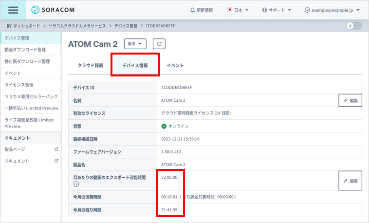
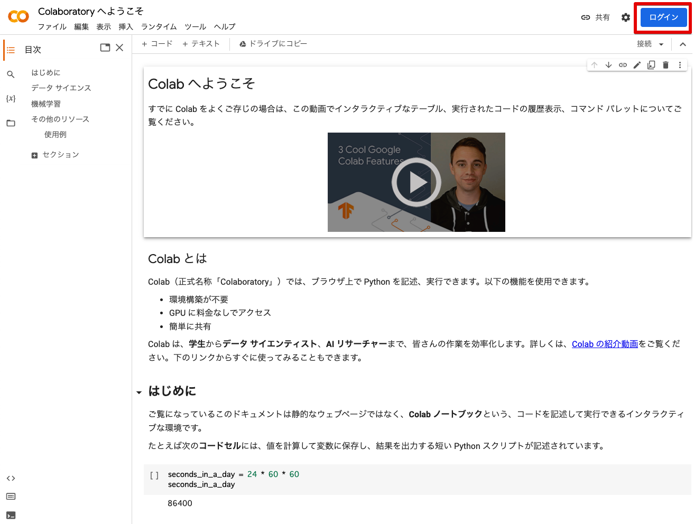
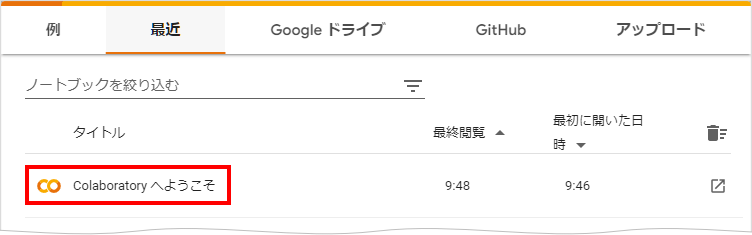
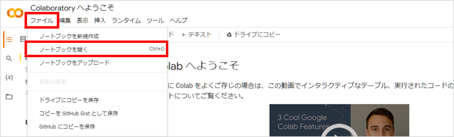
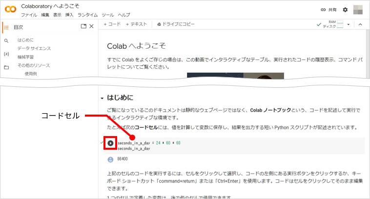
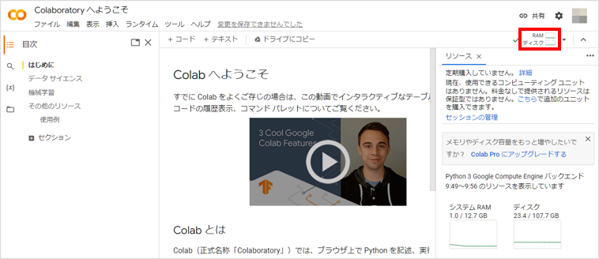
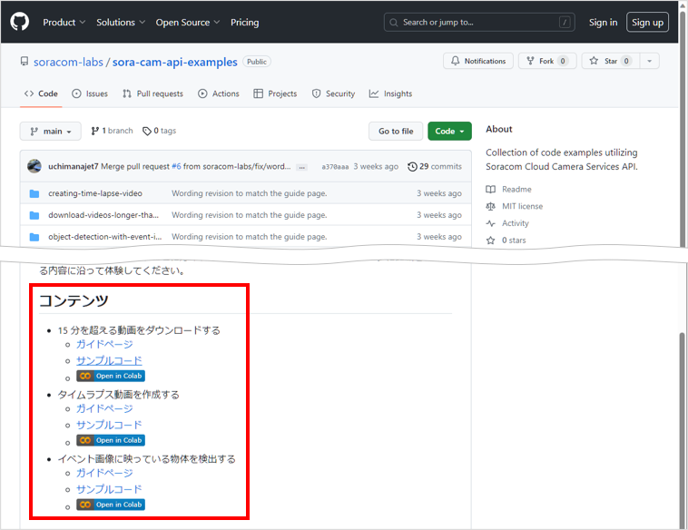
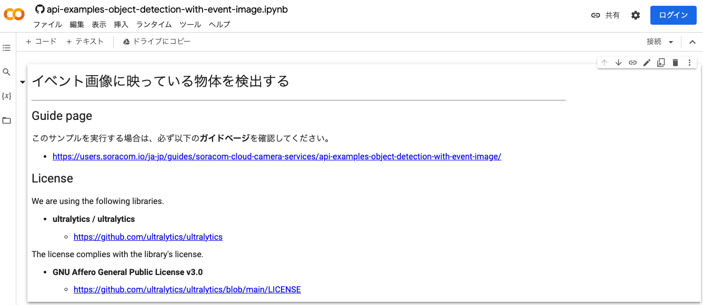
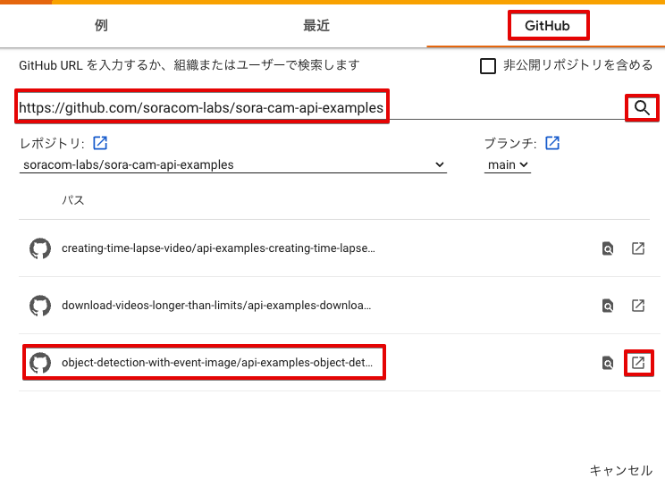

# API の使いかたについて

> [!IMPORTANT]
> このドキュメントは、アーカイブ済みリポジトリ内の参照用コンテンツです。
>
> - このリポジトリの更新は終了しています。
> - ソラカメに関する最新情報は [sora-cam.com](https://sora-cam.com/) を確認してください。
> - SORACOM API、Google Colab、Python パッケージ、外部 API の変更により、ノートブックが動作しなくなる可能性があります。

ソラカメ対応カメラでクラウドに [録画した映像](https://users.soracom.io/ja-jp/docs/soracom-cloud-camera-services/feature/#ソラカメ対応カメラで利用できる映像について) は [SORACOM API](https://users.soracom.io/ja-jp/tools/api/) (以下、API) を使って操作できます。

ここでは、ブラウザで Python を実行できる [Colaboratory](https://colab.research.google.com/)(以下、Colab) を使って、API の利用を体験できます。[ソラコムが提供するサンプルコード](https://github.com/soracom-labs/sora-cam-api-examples/) は、Colab ノートブック (Jupyter Notebook) 形式です。

サンプルコードを実行する前に、以下のステップに沿ってソラカメ対応カメラが操作できることを確認し、Colab の利用準備を行ってください。サンプルコードの内容や詳細は、サンプルコードの [GitHub リポジトリ](https://github.com/soracom-labs/sora-cam-api-examples/)  を参照してください。

> [!CAUTION]
> **Colaboratory はソラコムが提供するサービスではありません**
> - Colaboratory の利用には Google アカウントが必要です。
> - ソラコムは、Colaboratory に関するサポートを行いません。
> - Colaboratory については、Colaboratory の運営会社へ [お問い合わせ](https://research.google.com/colaboratory/faq.html) ください。

> [!WARNING]
> **サンプルコードの利用について**
> - サンプルコードでは、API を使って録画データを操作するため、[クラウドに動画が保存](https://users.soracom.io/ja-jp/docs/soracom-cloud-camera-services/watch-movie-stored-in-cloud/) されている必要があります。
> - サンプルコードの実行には SORACOM ユーザーコンソールの [ログイン情報](https://users.soracom.io/ja-jp/docs/user-console/log-in-to-user-console/) が必要です。
> - サンプルコードでは、実際に動画や静止画のエクスポートを行うため、[動画のエクスポート可能時間](https://users.soracom.io/ja-jp/docs/soracom-cloud-camera-services/set-monthly-limit/) が消費されます。
> - サンプルコードは、API の使いかたを紹介することを目的として提供されています。SORACOM サポートではサポートを行いません。
> - サンプルコードを実行したことによる利用者自身、もしくは第三者が被った損害に対して、直接的、間接的を問わず、株式会社ソラコムは責任を負いかねます。

## ステップ 1: サンプルコードを実行できる条件を確認する

サンプルコードを実行するには、以下の条件を満たす必要があります。

- ソラカメ対応カメラでクラウドへの録画ができていること。
- クラウド上に録画データがあること。
- SORACOM API を利用する権限があること。
- ソラカメ対応カメラごとに設定されている動画のエクスポート可能時間が残っていること。(動画のエクスポート可能時間を消費する API を利用する場合)

具体的には、ユーザーコンソールに [ルートユーザーまたは SAM ユーザー](https://users.soracom.io/ja-jp/guides/basic-knowledge/users/) でログインして、ソラカメ対応カメラが操作できることを確認します。

1. [ユーザーコンソールにルートユーザーまたは SAM ユーザーでログイン](https://users.soracom.io/ja-jp/docs/user-console/log-in-to-user-console/) します。

    サンプルコードを実行するときにも、ルートユーザーまたは SAM ユーザーのログイン情報が必要です。サンプルコードを実行するときに入力するログイン情報を使って、ユーザーコンソールにログインしてください。

2. ユーザーコンソールで [STEP 4: クラウドに保存された動画を再生できる](https://users.soracom.io/ja-jp/docs/soracom-cloud-camera-services/watch-movie-stored-in-cloud/) ことを確認します。

    > [!WARNING]
    > **ユーザーコンソールで操作できない場合**
    > SAM ユーザーでログインして上記の操作を実行したときに、権限に関するメッセージが表示された場合は、[SAM ユーザーの権限](https://users.soracom.io/ja-jp/docs/sam/set-permissions/) が足りない可能性があります。権限について、ルートユーザーに確認してください。

3. **[デバイス管理]** → 利用するソラカメ対応カメラ → **[デバイス情報]** タブの順にクリックして、[動画のエクスポート可能時間](https://users.soracom.io/ja-jp/docs/soracom-cloud-camera-services/set-monthly-limit/) の **[月あたりの動画のエクスポート可能時間]**、**[今月の消費時間]**、および **[今月の残り時間]** を確認します。

    

    特に **[今月の残り時間]** が 00:00:00 になると、一部の操作が制限されます。

> [!CAUTION]
> **動画のエクスポート可能時間の消費時間が 72 時間を超えると課金が発生します**
> サンプルコードを実行した結果、**[今月の消費時間]** が 72 時間を超えると課金が発生します。料金について詳しくは、Soracom Cloud Camera Services ソラカメの [料金について](https://soracom.jp/sora_cam/#pricing) を参照してください。

## ステップ 2: Colab の利用準備をする

Colab を使うために、Google アカウントでログインします。

1. [Colab](https://colab.research.google.com/) にアクセスして **[ログイン]** をクリックし、Google アカウントのメールアドレスとパスワードを入力して、Google アカウントにログインします。

    

2. **「Colaboratory へようこそ」** をクリックします

    

    「Colaboratory へようこそ」というノートブックが表示されます。

    > [!NOTE]
    > - 上記の画面を誤って閉じてしまった場合は、**[ファイル]** → **[ノートブックを開く]** の順にクリックすると、再表示できます。
    >
    >     
    > - 「Colaboratory へようこそ」が表示されない場合は、[https://colab.research.google.com/notebooks/intro.ipynb](https://colab.research.google.com/notebooks/intro.ipynb) にアクセスします。

3. 「はじめに」のコードセルにマウスポインターを合わせて **[▶]** をクリックします。

    

    正しく実行できると、ノートブックにリソースが割り当てられ、実行結果 (`86400`) がコードセルの下に表示されます。
    
4. **[RAM ディスク]** をクリックします。

    割り当てられたリソース (システム RAM とディスク) が表示されます。

    

    実行結果とリソースが確認できれば、Colab の利用準備は完了です。

## ステップ 3: 実行するサンプルコードを Colab で開く

ソラコムが提供するサンプルコードを Colab で開く手順を説明します。

1. 体験する内容を [GitHub リポジトリ](https://github.com/soracom-labs/sora-cam-api-examples/) の **「コンテンツ」** で確認します。

    

    - ガイドページ: コンテンツの体験方法を説明したページへのリンクです。
    - サンプルコード: Colab で開く Jupyter Notebook (**ipynb**) があるフォルダへのリンクです。
    - : サンプルコードを Colab で開くボタンです。

    > [!NOTE]
    > **ガイドページ**
    > コンテンツの体験方法は、以下のリンクをクリックしても確認できます。
    >
    > - [15 分を超える動画をダウンロードする](../download-videos-longer-than-limits/GUIDE.md)
    > - [タイムラプス動画を作成する](../creating-time-lapse-video/GUIDE.md)
    > - [イベント画像に映っている物体を検出する](../object-detection-with-event-image/GUIDE.md)
    > - [イベント画像にキャプションを付ける](../add-caption-to-event-image/GUIDE.md)
    > - [イベント画像を OpenAI で解析する](../analyze-event-image-with-openai/GUIDE.md)

2. 体験する内容のガイドページか、サンプルコードにある  アイコンをクリックします。

    

    Colab で体験するノートブック (ipynb) が表示されれば準備は完了です。

    > [!NOTE]
    > Colab からノートブック (ipynb) ファイルを開けます。
    >
    > 1. **[ファイル]** → **[ノートブックを開く]** の順にクリックします。
    >
    >     
    >
    > 2. **[GitHub]** をクリックして、サンプルコードの GitHub リポジトリ URL `https://github.com/soracom-labs/sora-cam-api-examples/` を入力して  アイコンをクリックします。
    >
    >     
    >
    > 3. 体験するノートブック (ipynb) ファイル、画像の場合は `object-detection-with-event-image/api-examples-object-detection-with-event-image.ipynb` の  アイコンをクリックして、ノートブックを開きます。 

## ステップ 4: 実際に API を使ったサンプルコードを実行する

準備がすべて終了したら、体験するサンプルコードのガイドページを参照し、ガイドページに沿って体験してください。

> [!NOTE]
> **警告が表示されることがあります**
> - GitHub からサンプルコードを実行する際、「警告: このノートブックは Google が作成したものではありません。」と表示されることがあります。表示された内容を確認して、**[このまま実行]** をクリックしてください。
>
>     
>
> - GitHub から実行したサンプルコードを修正して保存する際、「変更を保存できませんでした」と表示されることがあります。保存する場合には表示された内容を確認して、**[ドライブにコピーを保存]** をクリックしてください。ログインしている Google アカウントの Google ドライブ にノートブックのコピーが保存されます。
>
>     

## (参考) Colab 以外で実行する場合

最後に参考として、Colab 以外で実行する場合の簡単な Tips を紹介します。

> [!WARNING]
> **サンプルコードの利用について**
> - サンプルコードは、API の使いかたを紹介することを目的として提供されています。SORACOM サポートではサポートを行いません。
> - サンプルコードを実行したことによる利用者自身、もしくは第三者が被った損害に対して、直接的、間接的を問わず、株式会社ソラコムは責任を負いかねます。

### GitHub の soracom-labs / sora-cam-python-client を利用する

サンプルコードは、Colab 固有の表記をしている部分があります。これはたとえば、クラウド環境の FaaS で実行する場合には不要な部分です。
一方で、すべてを作っていくのも手間がかかる作業となるため、既存のツールを利用して短縮するのもひとつの手段です。

[sora-cam-python-client](https://github.com/soracom-labs/sora-cam-python-client) を使うことで、ソラカメ API の呼び出し部分を作り込みすることなく、API を利用したシステムの開発を始められます。
