# イベント画像にキャプションを付ける

ソラカメ対応カメラはイベントを検知して、イベント発生時の画像や動画を [クラウドに保存](https://users.soracom.io/ja-jp/docs/soracom-cloud-camera-services/check-event/) します。このイベント発生時の画像や動画を活用することで、イベントがあった時の状況や内容を把握できます。

たとえば、出入り口や搬入口にカメラを設置して、イベント発生時の画像や動画で、何が記録されているかを確認を取りたい場合があるとします。
その際、手作業で確認する場合は、検知したイベントの数に比例して多くの時間を使ってしまいます。AI を利用して、画像や映像の内容からキャプション (画像の説明文) が得られれば、何が記録されているかをキャプションの文字列から確認できます。

ここでは、[SORACOM API](https://users.soracom.io/ja-jp/tools/api/) (以下、API) を使ったサンプルコードを実行することで、イベント画像に対して学習済みモデルを使ったキャプション付けを体験できます。サンプルコードは、[Colaboratory](https://colab.research.google.com/)(以下、Colab) を使って実行します。

> [!CAUTION]
> **Colaboratory はソラコムが提供するサービスではありません**
> - Colaboratory の利用には Google アカウントが必要です。
> - ソラコムは、Colaboratory に関するサポートを行いません。
> - Colaboratory については、Colaboratory の運営会社へ [お問い合わせ](https://research.google.com/colaboratory/faq.html) ください。

> [!WARNING]
> **サンプルコードの利用について**
> - サンプルコードでは、API を使って録画データを操作するため、[クラウドに動画が保存](https://users.soracom.io/ja-jp/docs/soracom-cloud-camera-services/watch-movie-stored-in-cloud/) されている必要があります。
> - サンプルコードの実行には SORACOM ユーザーコンソールの [ログイン情報](https://users.soracom.io/ja-jp/docs/user-console/log-in-to-user-console/) が必要です。
> - サンプルコードでは、実際に動画や静止画のエクスポートを行うため、[動画のエクスポート可能時間](https://users.soracom.io/ja-jp/docs/soracom-cloud-camera-services/set-monthly-limit/) が消費されます。
> - サンプルコードは、API の使いかたを紹介することを目的として提供されています。SORACOM サポートではサポートを行いません。
> - サンプルコードを実行したことによる利用者自身、もしくは第三者が被った損害に対して、直接的、間接的を問わず、株式会社ソラコムは責任を負いかねます。

<details>
<summary>操作を始める前に準備が必要です (クリックして確認してください)</summary>

#### (1) サンプルコードを実行するための環境を準備する

ソラカメ対応カメラでクラウドに録画した映像を、SORACOM API を使って操作できることを確認してください。詳しくは、[API の使いかたについて](../about-api-examples/README.md) を参照してください。


**準備完了**
</details>

## サンプルコード

このページで使用するサンプルコードです。

  - [ api-examples-add-caption-to-event-image.ipynb](https://colab.research.google.com/github/soracom-labs/sora-cam-api-examples/blob/main/add-caption-to-event-image/api-examples-add-caption-to-event-image.ipynb)

リンクをクリックして Colab で開いて、ガイドページに沿って体験してください。

> [!NOTE]
> **警告が表示されることがあります**
> - GitHub からサンプルコードを実行する際、「警告: このノートブックは Google が作成したものではありません。」と表示されることがあります。表示された内容を確認して、**[このまま実行]** をクリックしてください。
>
>     
>
> - GitHub から実行したサンプルコードを修正して保存する際、「変更を保存できませんでした」と表示されることがあります。保存する場合には表示された内容を確認して、**[ドライブにコピーを保存]** をクリックしてください。ログインしている Google アカウントの Google ドライブ にノートブックのコピーが保存されます。
>
>     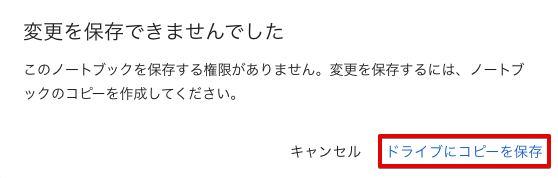

## ステップ 1: キャプション付けに使うライブラリをインストールする

サンプルコードで利用する、キャプション付けに使うライブラリをインストールします。Colab では pip コマンドが利用できるため、必要なライブラリを簡単にインストールできます。

1. サンプルコードの **[ステップ 1]** のコードセルにマウスポインターを合わせて **[▶]** クリックします。

    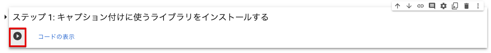

    pip コマンドが実行されライブラリのインストールが開始されます。インストールが正常に完了すると `Successfully installed` の行中に `salesforce-lavis-1.0.2` のようなメッセージが表示されます。

    合わせて `You must restart the runtime in order to use newly installed versions.` のような、ランタイムの再起動を求めるメッセージも表示されます。

    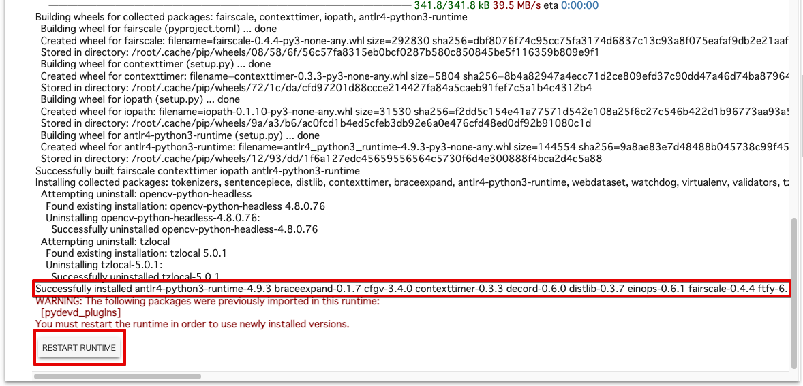

2. **[RESTRAT RUNTIME]** ボタンをクリックします。

3. 再起動の確認がされるので **[はい]** ボタンをクリックして再起動を実行します。

    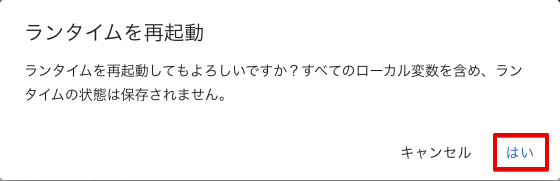

    > [!NOTE]
    > **利用しているライブラリ**
    > - ここでは [salesforce / LAVIS](https://github.com/salesforce/LAVIS) を利用しています。
    > - 利用しているライブラリは [BSD 3-Clause "New" or "Revised" License](https://github.com/salesforce/LAVIS/blob/main/LICENSE.txt) で提供されています。

## ステップ 2: サンプルコードの実行に必要なライブラリや定数を設定する

サンプルコード全体で利用するライブラリや関数、定数の定義を行います。ここで定義された内容は、他のコードセルでも利用できます。

1. サンプルコードの **[ステップ 2]** のコードセルにマウスポインターを合わせて **[▶]** クリックします。

    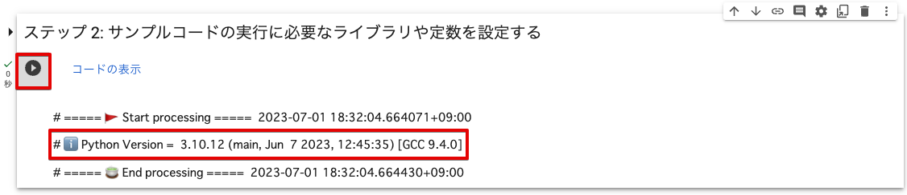

    実行結果に Python のバージョン (例: `# ℹ️ Python Version =  3.10.12 (main, Jun  7 2023, 12:45:35) [GCC 9.4.0]`) が表示されます。

## ステップ 3: SORACOM API を使うための認証処理をする

[SORACOM API](https://users.soracom.io/ja-jp/tools/api/) を使うための認証処理を行います。ユーザーコンソールのログイン情報を入力するフォームに必要な情報を入力して、**[Login]** をクリックすると SORACOM API の認証処理が実行され、このステップ以降で SORACOM API が実行できます。

> [!NOTE]
> **呼び出している SORACOM API**
> このステップでは、以下の SORACOM API を呼び出しています。
> | API | 説明 |
> |-|-|
> | [`Auth:auth API`](https://users.soracom.io/ja-jp/tools/api/reference/#/Auth/auth) | API アクセスの認証を行い、API キーと API トークンを発行する |

1. サンプルコードの **[ステップ 3]** の以下の項目を設定します。

    | 項目 | 説明 |
    |-|-|
    | **[endpoint_url]** | [SORACOM API の日本カバレッジのエンドポイント](https://users.soracom.io/ja-jp/tools/api/endpoints/) (`https://api.soracom.io/v1`) を入力します。 |
    | **[login_type]** | SORACOM API を利用するユーザーの種別を選択します。具体的なログイン情報は、手順 3 で入力します。<br><br>- Root User: ルートユーザーのログイン情報が分かる場合<br>- SAM User: SAM ユーザーのログイン情報が分かる場合 |
    | **[use_mfa]** | 多要素認証 (Multi-Factor Authentication: MFA) を有効化しているユーザーの場合はチェックします。<br><br>具体的なワンタイムパスワード (Time-based One-Time Password: TOTP) 情報は、手順 3 で入力します。 |

2. サンプルコードの **[ステップ 3]** のコードセルにマウスポインターを合わせて **[▶]** クリックします。

    

    実行結果にログイン情報の入力フォームが表示されます。

3. ログイン情報を入力して、**[Login]** をクリックします。

    - 手順 2 の **[login_type]** で「Root User」を選択した場合は、ルートユーザーのメールアドレスとパスワードを入力します。

        

    - 手順 2 の **[login_type]** で「SAM User」を選択した場合は、SAM ユーザーが所属するオペレーターのオペレーター ID、SAM ユーザー名、パスワードを入力します。

        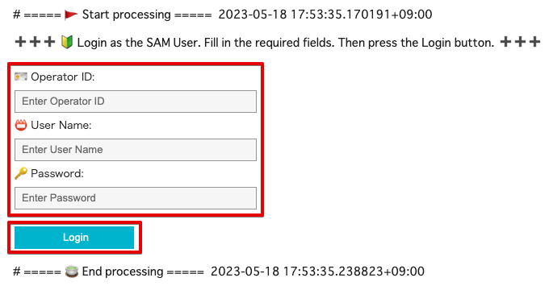

    - 手順 2 の **[use_mfa]** をチェックした場合は、MFA 認証コードを入力します。

        

    正しい認証情報を入力していれば、`# 🔑 API access has been authenticated 💯` と表示され、入力欄が初期化されます。

    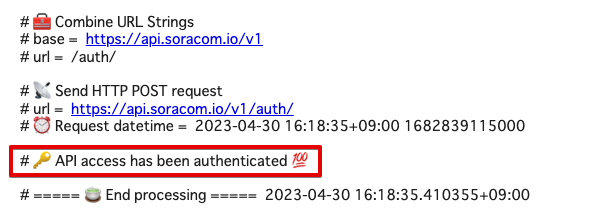


## ステップ 4: カメラを 1 台選択する

ソラカメ対応カメラの一覧を取得し、そこからソラカメ対応カメラを 1 台選択します。このステップ以降では、ここで選択したソラカメ対応カメラがクラウドに保存した動画や画像に対して、API で操作を行います。

> [!NOTE]
> **呼び出している SORACOM API**
> このステップでは、以下の SORACOM API を呼び出しています。
>
> | API | 説明 |
> |-|-|
> | [`SoraCam:listSoraCamDevices API`](https://users.soracom.io/ja-jp/tools/api/reference/#/SoraCam/listSoraCamDevices) | ソラカメ対応カメラの一覧を取得する |
> | [`SoraCam:getSoraCamDevice API`](https://users.soracom.io/ja-jp/tools/api/reference/#/SoraCam/getSoraCamDevice) | ソラカメ対応カメラの情報を取得する |
> | [`SoraCam:getSoraCamDeviceExportUsage API`](https://users.soracom.io/ja-jp/tools/api/reference/#/SoraCam/getSoraCamDeviceExportUsage) | ソラカメ対応カメラの静止画のエクスポート可能枚数や録画映像のエクスポート可能時間を取得する |

1. サンプルコードの **[ステップ 4]** のコードセルにマウスポインターを合わせて **[▶]** クリックします。

    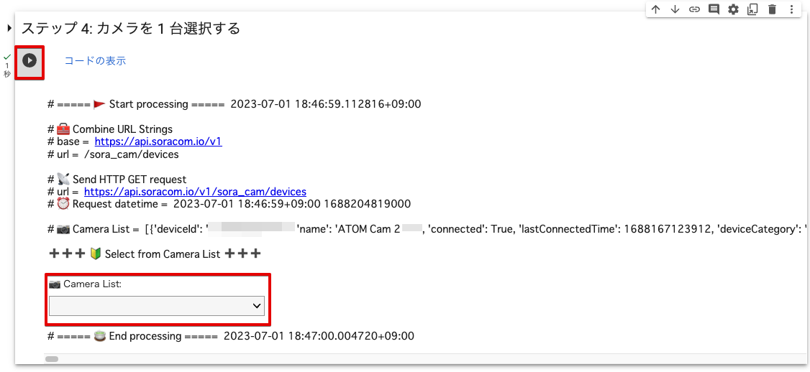

2. 実行結果に表示された **[📷 Camera List]** をクリックします。

    1 行ごとに 1 台のソラカメ対応カメラの情報が、`名前 / 状態 / ファームウェアバージョン / 製品名 / デバイス ID` の順に表示されます。

    

3. ソラカメ対応カメラを選択します。

    選択したソラカメ対応カメラの詳細情報 (JSON) と、選択したカメラのエクスポート可能時間 (JSON および `🔎 Time remaining of month =  72 hours 0 minutes 0 seconds`) が表示されます。

    **選択したカメラの詳細情報:**

    

    **選択したカメラのエクスポート可能時間:**

    

    > [!WARNING]
    > `Time remaining of month` が、選択したカメラの「今月の残り時間」です。`72 hours 0 minutes 0 seconds` と表示されている場合は、今月はあと 72 時間分の動画をエクスポートできます。このあとのステップで今月の残り時間を超えると、サンプルコードが動作しない可能性があります。必要に応じて、動画のエクスポート可能時間の上限を設定してください。詳しくは、[動画のエクスポート可能時間の上限を設定する](https://users.soracom.io/ja-jp/docs/soracom-cloud-camera-services/set-monthly-limit/) を参照してください。

## ステップ 5: イベント一覧を取得する期間を設定する

このステップと次のステップでは、前のステップで選択したソラカメ対応カメラがクラウドに記録したイベント一覧を取得して、イベントを 1 つ選択します。

1. サンプルコードの **[ステップ 5]** のコードセルにマウスポインターを合わせて **[▶]** クリックします。

    **[Start date]** などの入力欄が表示されます。

    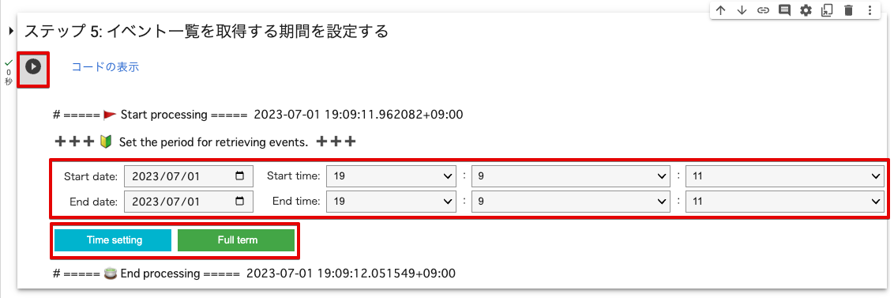

2. 以下の項目を入力します。

    | 項目 | 説明 |
    |-|-|
    | **[Start date]** | 開始日。例: `2023/05/02` |
    | **[Start time]** | 開始時刻。例: `10:33:31` |
    | **[End date]** | 終了日。例: `2023/05/02` |
    | **[End time]** | 終了時刻。例: `10:38:31` |

    > [!WARNING]
    > **開始日時と終了日時を設定してください**
    > 開始日時と終了日時の初期値は、どちらも実行した日時です。開始日時と終了日時を変更せずに **[Time setting]** をクリックすると、エラーが表示されます。
    >
    > 

3.  **[Time setting]** をクリックします。

    

    イベントを取得する期間が設定されます。

    > [!NOTE]
    > **すべての期間を対象にする場合**
    > 記録されているすべてのイベントを対象にする場合は、開始日時と終了日時を設定せずに、**[Full term]** をクリックします。**[Start date]**、**[Start time]**、**[End date]**、および **[End time]** は使用されません。
    >
    > 

## ステップ 6: 設定した期間のイベントから 1 つ選択する

前のステップで設定した期間で、ソラカメ対応カメラがクラウドに記録したイベント一覧を取得して、イベントを 1 つ選択します。

> [!NOTE]
> **呼び出している SORACOM API**
> このステップでは、以下の SORACOM API を呼び出しています。
>
> | API | 説明 |
> |-|-|
> | [`SoraCam:listSoraCamDeviceEventsForDevice API`](https://users.soracom.io/ja-jp/tools/api/reference/#/SoraCam/listSoraCamDeviceEventsForDevice) | ソラカメ対応カメラのイベント一覧を取得する |

1. サンプルコードの **[ステップ 6]** の以下の項目を設定します。

    | 項目 | 説明 |
    |-|-|
    | **[streamable_events]** | ストリーミング再生できるイベントのみを表示する場合は、チェックを入れます。 |

1. サンプルコードの **[ステップ 6]** のコードセルにマウスポインターを合わせて **[▶]** クリックします。

    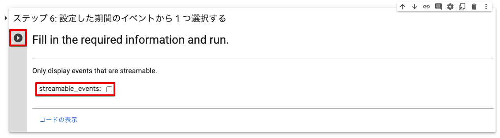

1. 実行結果に表示された **[🌈 Event List]** をクリックします。

    

    1 行ごとに 1 つのイベント情報が、`日時 / イベントタイプ / イベントの録画状況 / イベント画像の有無 / イベント動画のストリーミング再生可否` の順に表示されます。

    

1. イベントを選択します。

    選択したイベントの情報 (JSON) が表示されます。

    

    > [!NOTE]
    > イベント画像の有無と、イベント動画のストリーミング再生可否は、`eventInfo.atomEventV1` の以下のプロパティを確認しています。
    > - `picture` の URL がある場合は、イベント画像があると判定しています。
    > - `startTime` と `endTime` がある場合は、イベント動画がストリーミング再生できると判定しています。

## ステップ 7: 選択したイベントのストリーミングを再生する

前のステップで選択したイベントの動画を、[ストリーミング再生](https://users.soracom.io/ja-jp/docs/soracom-cloud-camera-services/watch-movie-stored-in-cloud/) します。再生するイベント動画の長さ分「動画のエクスポート可能時間」が消費されます。Colab 上で動画を再生することで、この後のステップで検出できる対象物があるかどうかを確認します。

> [!NOTE]
> **呼び出している SORACOM API**
> このステップでは、以下の SORACOM API を呼び出しています。
>
> | API | 説明 |
> |-|-|
> | [`SoraCam:getSoraCamDeviceStreamingVideo API`](https://users.soracom.io/ja-jp/tools/api/reference/#/SoraCam/getSoraCamDeviceStreamingVideo) | ストリーミング映像 (最新映像 / 録画映像) をダウンロードするための情報を取得する |
> | [`SoraCam:getSoraCamDeviceExportUsage API`](https://users.soracom.io/ja-jp/tools/api/reference/#/SoraCam/getSoraCamDeviceExportUsage) | ソラカメ対応カメラの静止画のエクスポート可能枚数や録画映像のエクスポート可能時間を取得する |

1. サンプルコードの **[ステップ 7]** のコードセルにマウスポインターを合わせて **[▶]** クリックします。

    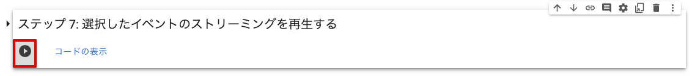

    ストリーミング再生用の URL が発行され、動画の再生が始まります。

    

    > [!NOTE]
    > **URL には有効期限が設定されているため一定時間で再生が停止します**
    > - ストリーミング再生用の URL には有効期限が設定されています。そのため、有効期限が経過してから再生バーを操作すると、動画は再生されません。
    > - **[Reload video]** をクリックすると、同じイベント動画のストリーミング再生がもう一度行われます。「動画のエクスポート可能時間」が消費されます。

## ステップ 8: 選択したイベントの画像をダウンロードする

選択したイベントの画像をダウロードします。ダウンロード先は Colab 内です。**この操作で「動画のエクスポート可能時間」は消費されません。**

1. サンプルコードの **[ステップ 8]** のコードセルにマウスポインターを合わせて **[▶]** クリックします。

    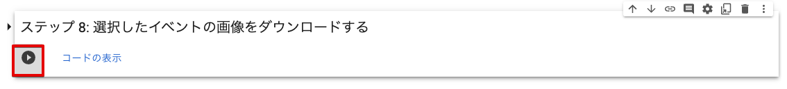

    静止画ファイル (jpg ファイル) が Colab 内にダウンロードされます。
    ダウンロードが正常に完了すると `The event image has been saved.` のようなメッセージが表示されます。

    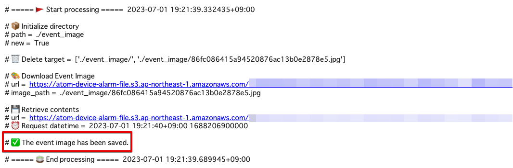

    > [!NOTE]
    > **イベント画像のダウンロード用 URL には有効期限が設定されているため一定時間で URL が失効します**
    > - イベント画像のダウンロード用 URL には有効期限が設定されています。そのため、有効期限が経過してから上記の操作を行ってもダウンロードできません。
    > - [ステップ 6: 設定した期間のイベントから 1 つ選択する](#ステップ-6-設定した期間のイベントから-1-つ選択する) から再実行してダウンロードしてください。

2.  をクリックします。

    「event_image」ディレクトリと、ダウンロードされたイベント画像ファイルが表示されます。

    

## ステップ 9: ダウンロードしたイベント画像を確認する

前のステップで Colab 内にダウンロードしたイベント画像を表示して確認します。

1. サンプルコードの **[ステップ 9]** のコードセルにマウスポインターを合わせて **[▶]** クリックします。

    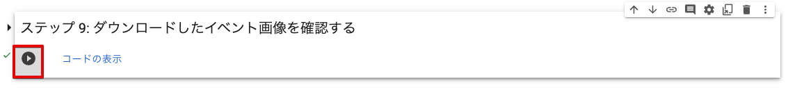

    実行結果にダウンロードしたイベント画像が表示されます。

    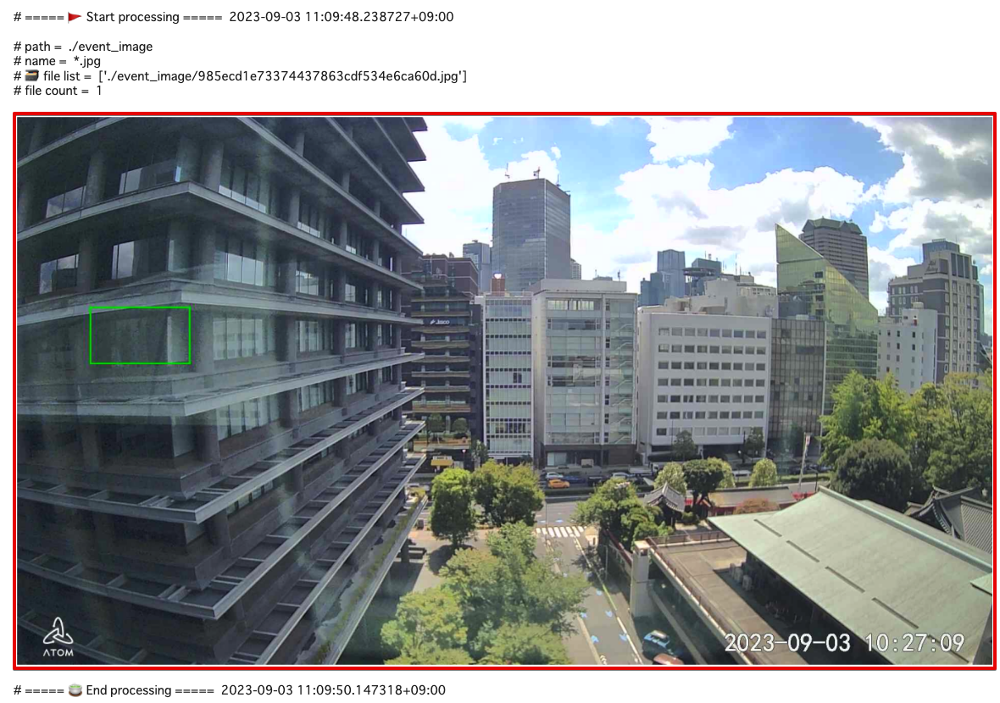

    > [!NOTE]
    > イベント画像が正しく表示されない場合は  をクリックして画像ファイルを直接確認してください。

## ステップ 10: イベント画像にキャプションを付ける

Colab 内にダウンロードしたイベント画像に対して、ライブラリを利用してキャプションを付けます。

1. サンプルコードの **[ステップ 10]** のコードセルにマウスポインターを合わせて **[▶]** クリックします。

    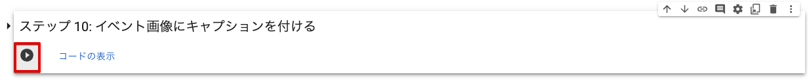

    実行結果にキャプションの内容が英語で表示されます。

    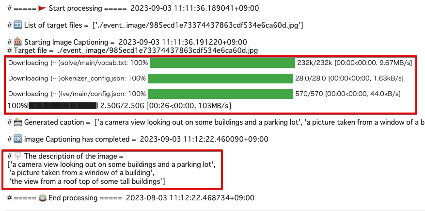

    実行結果に表示されている以下の部分が、このイベント画像に対してのキャプションです。
    
    ```
    # 🪧 The description of the image =
    ['a camera view looking out on some buildings and a parking lot',
    'a picture taken from a window of a building',
    'the view from a roof top of some tall buildings']
    ```
    
    キャプションは実行時に生成されているため、実行するごと異なる結果になることがあります。また、今回利用したライブラリの設定でキャプションを 3 つ出力しています。これは、キャプション自体が自動生成となるため、ある程度のバリエーションがあることを体験してもらうためです。

    > [!NOTE]
    > 初回実行時に、キャプション付けに利用するファイルが自動的に Colab にダウンロードされます。

## ステップ 11: イベント画像に Visual Question Answering (VQA) を行う

イベント画像に VQA を行います。VQA は、対象の画像についての質問を自然言語で入力すると、AI が画像の内容を読み取って質問に対して文字列で返答を行います。
今回利用しているライブラリでは、質問は `英語` で入力する必要があります。画像に関する質問に AI が回答するため、キャプション付けと異なり自由に質問内容を変更できます。

1. サンプルコードの **[ステップ 11]** の以下の項目を設定します。

    | 項目 | 説明 |
    |-|-|
    | **[vqa_question]** | 画像に関する質問を `英語` で入力します。 |

1. サンプルコードの **[ステップ 11]** のコードセルにマウスポインターを合わせて **[▶]** クリックします。

    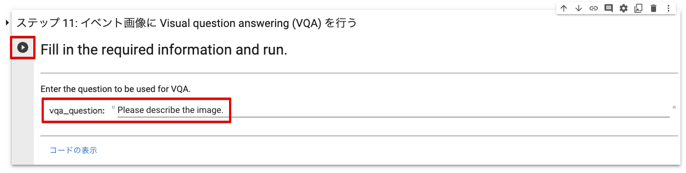

    実行結果に、VQA の回答結果が表示されます。

    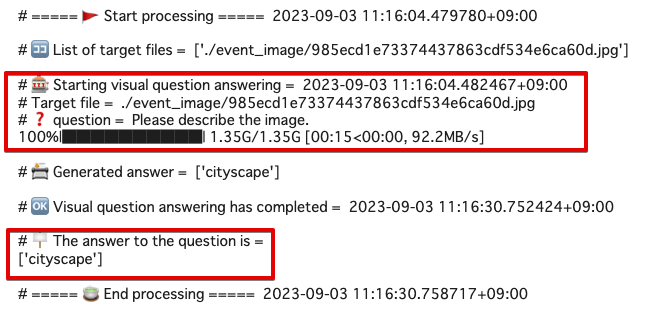

    実行結果に表示されている `# 🪧 The answer to the question is =
    ['cityscape']` の部分が、VQA の回答結果です。回答は実行時に生成されているため、実行するごと異なる結果になることがあります。

    > [!NOTE]
    > 初回実行時に、VQA に利用するファイルが自動的に Colab にダウンロードされます。

## ステップ 12: ローカル環境にダウンロードするディレクトリを選択する

これまでのステップで Colab 内に保存したファイルを、ローカル環境にダウンロードするための準備として、イベント画像ファイルが保存されているディレクトリを選択します。

1. サンプルコードの **[ステップ 12]** のコードセルにマウスポインターを合わせて **[▶]** クリックします。

    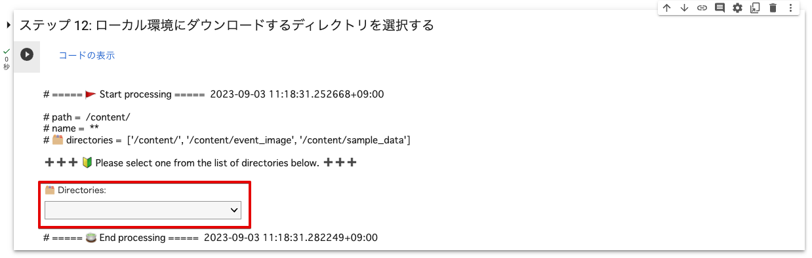

2. **[🗂️ Directories]** をクリックして、「/content/event_image」を選択します。

    

    `# 📄 File List` (ディレクトリ内のファイル一覧) が表示されます。

    

## ステップ 13: 選択したディレクトリをローカル環境にダウンロードする

Colab 内に保存したファイルしを zip 形式で圧縮して、ローカル環境にダウンロードします。

1. サンプルコードの **[ステップ 13]** のコードセルにマウスポインターを合わせて **[▶]** クリックします。

    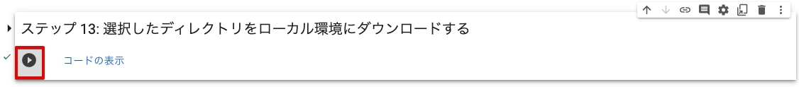

    前のステップで選択したディレクトリを zip 形式で圧縮したファイルがダウンロードされます。

    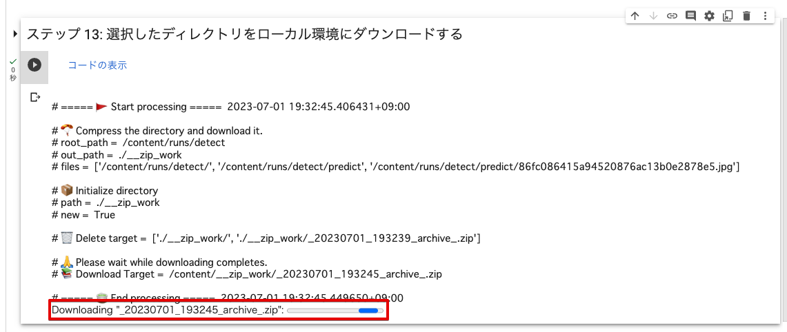

1. ローカル環境にダウンロードされた zip 形式で圧縮したファイルを展開して、イベント画像ファイルが表示できることを確認します。

    

    上記の例では、`_20230701_193245_archive_.zip` という zip 形式のファイルがローカルにダウンロードされます。

    > [!NOTE]
    > **Colab 内のファイルとローカル環境のファイルを比較してください**
    > 「/content/__zip_work/」ディレクトリのすべてのファイルがローカル環境にダウンロードされていれば、実行は成功しています。
    >
    > 
    >
    > 上記の例では、jpg ファイルが イベント画像のファイルです。
    >
    > 
    >
    > なお、ブラウザの設定で複数ファイルのダウンロードが許可されていない場合は、上記のような表示が出ることがあります。表示内容を確認し、**[許可する]** をクリックして、ダウンロードを続行してください。

## まとめ

[SORACOM API](https://users.soracom.io/ja-jp/tools/api/) とライブラリを使って、ユーザーコンソールでは実現できない **イベント画像にキャプションを付ける** サンプルコードを Colab で体験できました。ステップごとの解説とサンプルコードを参考に、実際のユースケースでも SORACOM API やライブラリを活用して、新しい使いかたや自動化、省力化にチャレンジしてください。

## (参考) サンプルコードを変更する場合

最後に参考として、サンプルコードを変更して実行する場合の簡単な Tips を紹介します。

> [!WARNING]
> **サンプルコードの利用について**
> - サンプルコードは、API の使いかたを紹介することを目的として提供されています。SORACOM サポートではサポートを行いません。
> - サンプルコードを実行したことによる利用者自身、もしくは第三者が被った損害に対して、直接的、間接的を問わず、株式会社ソラコムは責任を負いかねます。

### 新しいバージョンのフレームワークを試してみる

サンプルコードでは、BLIP というフレームワークを利用しました。今回利用した BLIP には新しいバージョンの [BLIP-2](https://github.com/salesforce/LAVIS/tree/main/projects/blip2) が用意されています。精度もスピードも BLIP より優れていますが、Colab の無料枠ではリソース不足で動作しませんでした。有償版の Colab を使っている場合や、別の環境で動作させる場合には新しいバージョンの BLIP-2 の利用も検討してみてください。`load_model_and_preprocess` に渡しているモデルの名称を BLIP-2 に対応したものに変更するだけで試せます。その他詳しい内容はライブラリのページを参照してください。

```python
# Add a caption to an image
def generate_image_caption(file_path: str) -> list:
    print()
    print('# 🎰 Starting Image Captioning = ', datetime.now(JST))
    print('# Target file = ', file_path)

    # Load an image.
    raw_image = Image.open(file_path).convert('RGB')

    # Is GPU available?
    device = torch.device("cuda") if torch.cuda.is_available() else "cpu"

    # Load the model for captioning.
    model, vis_processors, _ = load_model_and_preprocess(name="blip_caption", model_type="base_coco", is_eval=True, device=device)

    # prepare the image as model input using the associated processors
    image = vis_processors["eval"](raw_image).unsqueeze(0).to(device)

    # generate multiple captions using nucleus sampling
    result = model.generate({"image": image}, use_nucleus_sampling=True, num_captions=3)

    print()
    print('# 📇 Generated caption = ', result)
    print()
    print('# 🆗 Image Captioning has completed = ', datetime.now(JST))

    return result
```

### API トークンの有効期限を変更する

サンプルコードでは、API トークンの有効期限を「3600 秒 (1 時間)」に設定しています。有効期限を変更する場合には `authenticate_user()` を呼び出す際、引数 `timeout` に有効期限を設定してください。有効期限に指定できる範囲については、[`Auth:auth API`](https://users.soracom.io/ja-jp/tools/api/reference/#/Auth/auth) を参照してください。

```python
# /auth
# Authenticate API access and issue API key and API token
# https://users.soracom.io/ja-jp/tools/api/reference/#/Auth/auth
def authenticate_user(self, email: str, password: str, opid: str, name: str, mfa_code: str = None, timeout: int = 3600) -> APIResult:
    api_path = '/auth/'
    url = merge_url(self.endpoint_url, api_path)
    headers = {'Content-Type': 'application/json'}

    # authentication uses the following values
    # Root: email, password
    # SAM: opid, name, password
    data = dict()

    # prepare the value for the Root case
    if email != None and email != '':
        if password != None and password != '':
            data['email'] = email
            data['password'] = password

    # prepare the value for the SAM case
    # If both are valid, SAM is preferred
    if opid != None and opid != '':
        if name != None and name != '':
            if password != None and password != '':
                data['operatorId'] = opid
                data['userName'] = name
                data['password'] = password

    # set the API key expiration time (Default 1 hour)
    data['tokenTimeoutSeconds'] = timeout

    # MFA Authentication Code
    if mfa_code != None and mfa_code != '':
        data['mfaOTPCode'] = mfa_code

    # Send Request
    return send_post_request(url, headers=headers, data=data)
```
