# イベント画像を OpenAI で解析する

> [!IMPORTANT]
> このサンプルは、アーカイブ済みリポジトリ内の参照用コンテンツです。
>
> - このリポジトリの更新は終了しています。
> - ソラカメに関する最新情報は [sora-cam.com](https://sora-cam.com/) を確認してください。
> - SORACOM API、Google Colab、Python パッケージ、外部 API の変更により、ノートブックが動作しなくなる可能性があります。

ソラカメ対応カメラはイベントを検知して、[イベント発生時の画像や動画を保存](https://users.soracom.io/ja-jp/docs/soracom-cloud-camera-services/check-event/) します。このイベント発生時の画像や動画を活用することで、イベントがあった時の状況やイベントの内容を把握できます。

たとえば、施設の出入り口や搬入口にカメラを設置して、イベント発生時の画像や動画で、何が記録されているかを確認することを考えます。
その際、手作業で確認する場合は、検知したイベントの数に比例して多くの時間を使ってしまいます。AI を利用して、画像や映像の解析ができれば、何が記録されているかを解析結果の文字列で確認できます。

ここでは、[SORACOM API](https://users.soracom.io/ja-jp/tools/api/) (以下、API) を使ったサンプルコードを実行することで、イベント画像に対して [OpenAI API](https://platform.openai.com/docs/guides/vision) を使って画像解析を体験できます。OpenAI のサービスである [ChatGPT](https://chat.openai.com/) と同様に、イベント画像に対して自然言語で質問や確認を行えます。サンプルコードは、[Colaboratory](https://colab.research.google.com/)(以下、Colab) を使って実行します。

> [!CAUTION]
> **Colaboratory はソラコムが提供するサービスではありません**
>     - Colaboratory の利用には Google アカウントが必要です。
>     - ソラコムは、Colaboratory に関するサポートを行いません。
>     - Colaboratory については、運営会社へ直接 [お問い合わせ](https://research.google.com/colaboratory/faq.html) ください。

> [!CAUTION]
> **OpenAI API はソラコムが提供するサービスではありません**
>     - OpenAI API の利用には OpenAI アカウントで発行できる API キーが必要です。
>     - OpenAI API の利用には別途料金がかかります。
>     - ソラコムは OpenAI API に関するサポートを行いません。
>     - OpenAI API については、運営会社へ直接 [お問い合わせ](https://help.openai.com/en/) ください。

> [!WARNING]
> **サンプルコードの利用について**
>     - サンプルコードでは、API を使って録画データを操作するため、[クラウドに動画が保存](https://users.soracom.io/ja-jp/docs/soracom-cloud-camera-services/watch-movie-stored-in-cloud/) されている必要があります。
>     - サンプルコードの実行には SORACOM ユーザーコンソールの [ログイン情報](https://users.soracom.io/ja-jp/docs/user-console/log-in-to-user-console/) が必要です。
>     - サンプルコードでは、実際に動画や静止画のエクスポートを行うため、[動画のエクスポート可能時間](https://users.soracom.io/ja-jp/docs/soracom-cloud-camera-services/set-monthly-limit/) が消費されます。
>     - サンプルコードは、API の使いかたを紹介することを目的として提供されています。SORACOM サポートではサポートを行いません。
>     - サンプルコードを実行したことによる利用者自身、もしくは第三者が被った損害に対して、直接的、間接的を問わず、株式会社ソラコムは責任を負いかねます。

<details>
<summary>操作を始める前に準備が必要です (クリックして確認してください)</summary>

    #### (1) サンプルコードを実行するための環境を準備する

    ソラカメ対応カメラでクラウドに録画した映像を、SORACOM API を使って操作できることを確認してください。詳しくは、[API の使いかたについて](../about-api-examples/README.md) を参照してください。

**準備完了**
</details>

## サンプルコード

このページで使用するサンプルコードです。

- [ api-examples-analyze-event-image-with-openai.ipynb](https://colab.research.google.com/github/soracom-labs/sora-cam-api-examples/blob/main/analyze-event-image-with-openai/api-examples-analyze-event-image-with-openai.ipynb)

リンクをクリックして Colab で開いて、ガイドページに沿って体験してください。

> [!NOTE]
> **警告が表示されることがあります**
>     - GitHub からサンプルコードを実行する際、「警告: このノートブックは Google が作成したものではありません。」と表示されることがあります。表示された内容を確認して、**[このまま実行]** をクリックしてください。
>
>         
>
>     - GitHub から実行したサンプルコードを修正して保存する際、「変更を保存できませんでした」と表示されることがあります。保存する場合には表示された内容を確認して、**[ドライブにコピーを保存]** をクリックしてください。ログインしている Google アカウントの Google ドライブ にノートブックのコピーが保存されます。
>
>         

## ステップ 1: OpenAI のライブラリをインストールする

サンプルコードで利用する、OpenAI のライブラリをインストールします。Colab では pip コマンドが利用できるため、必要なライブラリを簡単にインストールできます。

> [!NOTE]
> **利用しているライブラリ**
>     - ここでは [openai / openai-python](https://github.com/openai/openai-python) を利用しています。
>     - 利用しているライブラリは [Apache License 2.0](https://github.com/openai/openai-python/blob/main/LICENSE) で提供されています。

1. サンプルコードの **[ステップ 1]** のコードセルにマウスポインターを合わせて **[▶]** をクリックします。

    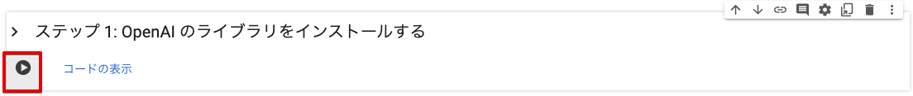

    pip コマンドが実行されライブラリのインストールが開始されます。インストールが正常に完了すると `Successfully installed` の行中に `openai-1.6.0` のようなメッセージが表示されます。

    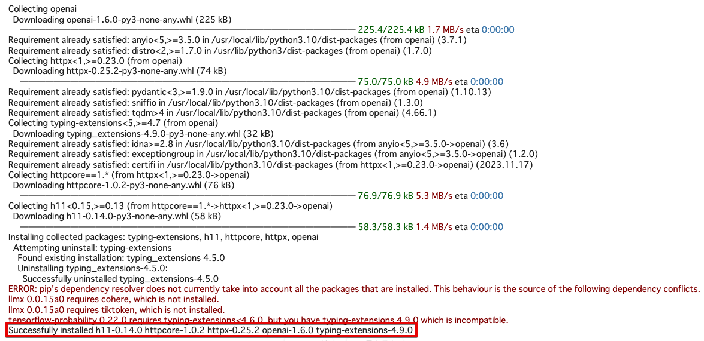

    > [!NOTE]
    > **エラーが表示されることがあります**
    >     - 「ERROR: pip's dependency resolver does not currently take into account all the packages that are installed. This behaviour is the source of the following dependency conflicts.」という依存関係のエラーメッセージが表示されることがありますが、インストールが正常に完了していればサンプルは実行できます。
    >     - 再実行することで「Requirement already satisfied: openai in /usr/local/lib/python3.10/dist-packages (1.6.0)」のようなメッセージでインストール状態が確認できます。
    >         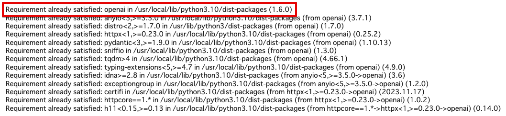

## ステップ 2: サンプルコードの実行に必要なライブラリや定数を設定する

サンプルコード全体で利用するライブラリや関数、定数の定義を行います。ここで定義された内容は、他のコードセルでも利用できます。

1. サンプルコードの **[ステップ 2]** のコードセルにマウスポインターを合わせて **[▶]** をクリックします。

    

    実行結果に Python のバージョン (例: `# ℹ️ Python Version =  3.10.12 (main, Jun  7 2023, 12:45:35) [GCC 9.4.0]`) が表示されます。

## ステップ 3: OpenAI API の API キーを入力する

[OpenAI API](https://platform.openai.com/docs/introduction) を使うために OpenAI の [API キー](https://platform.openai.com/docs/quickstart/account-setup) を入力します。API キー情報を入力するフォームに必要な情報を入力して、**[Apply]** をクリックすると OpenAI API のライブラリに API キー が設定され、このステップ以降で OpenAI API が利用できます。

1. サンプルコードの **[ステップ 3]** の以下の項目を設定します。

    | 項目 | 説明 |
    |-|-|
    | **[use_org]** | [Organization ID](https://platform.openai.com/docs/api-reference/organization-optional) を指定する場合はチェックします。 |

1. サンプルコードの **[ステップ 3]** のコードセルにマウスポインターを合わせて **[▶]** をクリックします。

    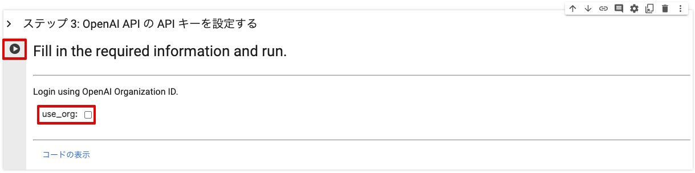

    実行結果に API キー情報の入力フォームが表示されます。

1. API キー情報を入力して、**[Apply]** をクリックします。

    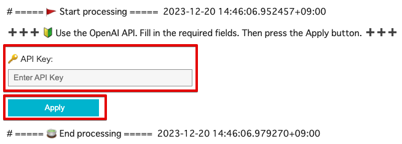

    - 手順 1 の **[use_org]** をチェックした場合は、Organization ID を入力します。

        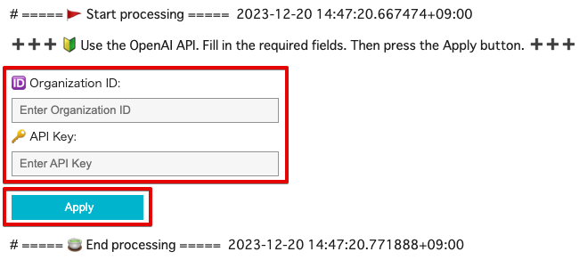

    正しい API キー情報を入力していれば、`# 🔑 API access has been verified. 💯` と表示され、入力欄が初期化されます。

    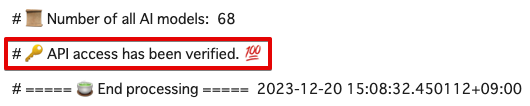

## ステップ 4: 利用する AI モデルを選択する

画像解析に利用する AI モデルを [OpenAI が提供している AI モデル](https://platform.openai.com/docs/models) から選択します。画像解析に対応した AI モデルを選択してください。

1. サンプルコードの **[ステップ 4]** のコードセルにマウスポインターを合わせて **[▶]** をクリックします。

    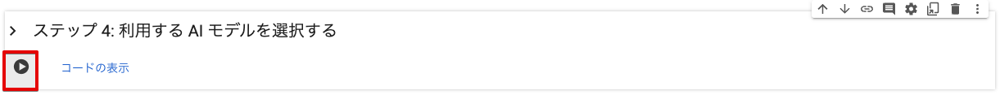

1. 実行結果に表示された **[🏞️ Vision models]** をクリックします。

    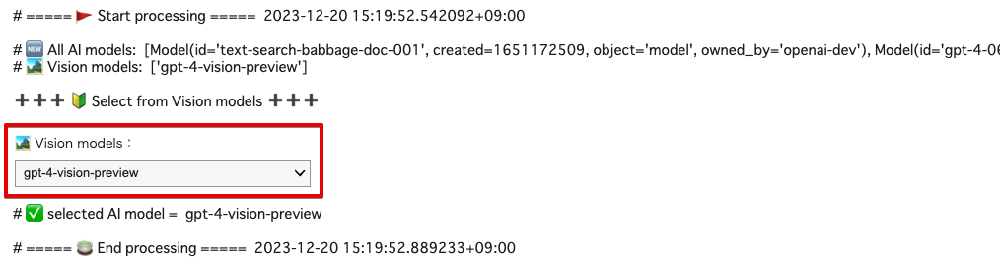

    1 行ごとに 1 つの AI モデル名が表示されます。`-vision` を含んだ画像に対応したモデルのみ表示します。

    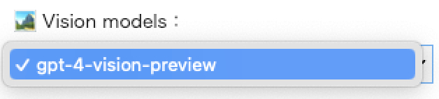

1. AI モデルを選択します。

    選択できる AI モデルが 1 つしか存在しない場合は、自動的に選択されます。

    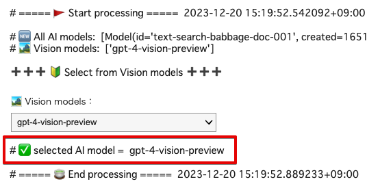

## ステップ 5: SORACOM API を使うための認証処理をする

[SORACOM API](https://users.soracom.io/ja-jp/tools/api/) を使うための認証処理を行います。ユーザーコンソールのログイン情報を入力するフォームに必要な情報を入力して、**[Login]** をクリックすると SORACOM API の認証処理が実行され、このステップ以降で SORACOM API が利用できます。

> [!NOTE]
> **呼び出している SORACOM API**
>     このステップでは、以下の SORACOM API を呼び出しています。
>     | API | 説明 |
>     |-|-|
>     | [`Auth:auth API`](https://users.soracom.io/ja-jp/tools/api/reference/#/Auth/auth) | API アクセスの認証を行い、SORACOM API の API キーと API トークンを発行する |

1. サンプルコードの **[ステップ 5]** の以下の項目を設定します。

    | 項目 | 説明 |
    |-|-|
    | **[endpoint_url]** | [SORACOM API の日本カバレッジのエンドポイント](https://users.soracom.io/ja-jp/tools/api/endpoints/) (`https://api.soracom.io/v1`) を入力します。 |
    | **[login_type]** | SORACOM API を利用するユーザーの種別を選択します。具体的なログイン情報は、手順 3 で入力します。<br><br>- Root User: ルートユーザーのログイン情報が分かる場合<br>- SAM User: SAM ユーザーのログイン情報が分かる場合 |
    | **[use_mfa]** | 多要素認証 (Multi-Factor Authentication: MFA) を有効化しているユーザーの場合はチェックします。<br><br>具体的なワンタイムパスワード (Time-based One-Time Password: TOTP) 情報は、手順 3 で入力します。 |

2. サンプルコードの **[ステップ 5]** のコードセルにマウスポインターを合わせて **[▶]** をクリックします。

    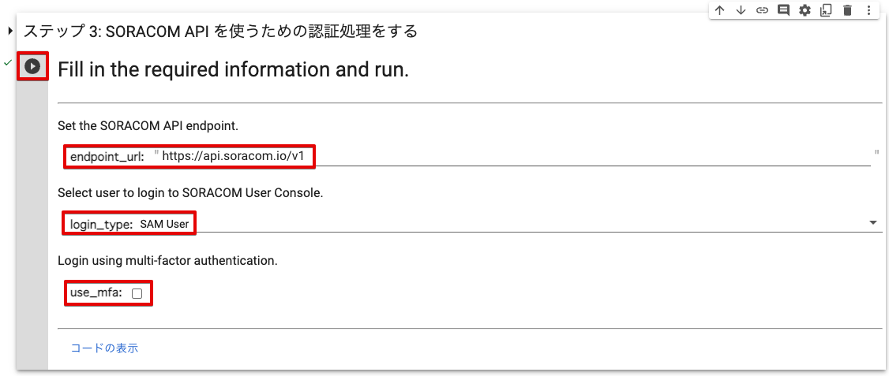

    実行結果にログイン情報の入力フォームが表示されます。

3. ログイン情報を入力して、**[Login]** をクリックします。

    - 手順 1 の **[login_type]** で「Root User」を選択した場合は、ルートユーザーのメールアドレスとパスワードを入力します。

        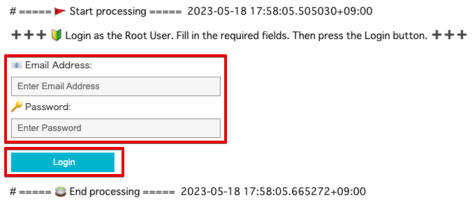

    - 手順 1 の **[login_type]** で「SAM User」を選択した場合は、SAM ユーザーが所属するオペレーターのオペレーター ID、SAM ユーザー名、パスワードを入力します。

        

    - 手順 1 の **[use_mfa]** をチェックした場合は、MFA 認証コードを入力します。

        

    正しい認証情報を入力していれば、`# 🔑 API access has been authenticated 💯` と表示され、入力欄が初期化されます。

    

## ステップ 6: カメラを 1 台選択する {#select-camera}

ソラカメ対応カメラの一覧を取得し、そこからソラカメ対応カメラを 1 台選択します。このステップ以降では、ここで選択したソラカメ対応カメラがクラウドに保存した動画や画像に対して、API で操作を行います。

> [!NOTE]
> **呼び出している SORACOM API**
>     このステップでは、以下の SORACOM API を呼び出しています。
>
>     | API | 説明 |
>     |-|-|
>     | [`SoraCam:listSoraCamDevices API`](https://users.soracom.io/ja-jp/tools/api/reference/#/SoraCam/listSoraCamDevices) | ソラカメ対応カメラの一覧を取得する |
>     | [`SoraCam:getSoraCamDevice API`](https://users.soracom.io/ja-jp/tools/api/reference/#/SoraCam/getSoraCamDevice) | ソラカメ対応カメラの情報を取得する |
>     | [`SoraCam:getSoraCamDeviceExportUsage API`](https://users.soracom.io/ja-jp/tools/api/reference/#/SoraCam/getSoraCamDeviceExportUsage) | ソラカメ対応カメラの静止画のエクスポート可能枚数や録画映像のエクスポート可能時間を取得する |
>     | [`SoraCam:getSoraCamDeviceAtomCamSettings API`](https://users.soracom.io/ja-jp/tools/api/reference/#/SoraCam/getSoraCamDeviceAtomCamSettings) | ソラカメ対応カメラの各種設定を取得する |

1. サンプルコードの **[ステップ 6]** の以下の項目を設定します。

    | 項目 | 説明 |
    |-|-|
    | **[connectable_cameras]** | オンライン状態のカメラのみ表示する場合はチェックします。 |

1. サンプルコードの **[ステップ 6]** のコードセルにマウスポインターを合わせて **[▶]** をクリックします。

    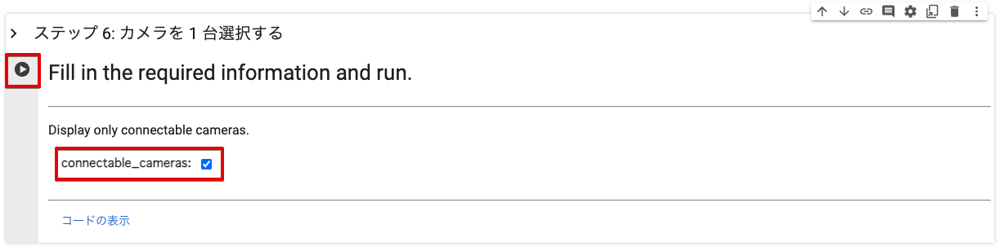

2. 実行結果に表示された **[📷 Camera List]** をクリックします。

    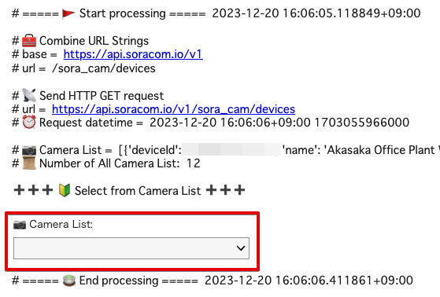

    1 行ごとに 1 台のソラカメ対応カメラの情報が、`名前 / 状態 / ファームウェアバージョン / 製品名 / デバイス ID` の順に表示されます。

    

3. ソラカメ対応カメラを選択します。

    選択したソラカメ対応カメラの詳細情報 (JSON)、選択したカメラの各種設定 (JSON)、選択したカメラのエクスポート可能時間 (JSON および `# 🔎 Time remaining of month =  69 hours 25 minutes 51 seconds`) が表示されます。

    **選択したカメラの詳細情報:**

    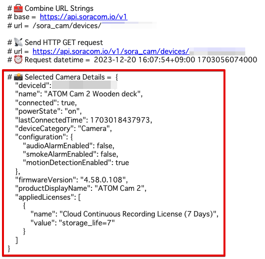

    **選択したカメラの各種設定:**

    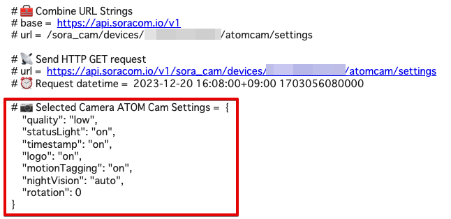

    **選択したカメラのエクスポート可能時間:**

    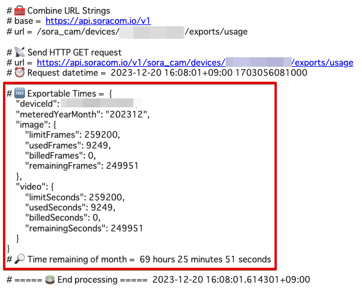

    > [!WARNING]
    >     `Time remaining of month` が、選択したカメラの「今月の残り時間」です。`72 hours 0 minutes 0 seconds` と表示されている場合は、今月はあと 72 時間分の動画をエクスポートできます。このあとのステップで今月の残り時間を超えると、サンプルコードが動作しない可能性があります。必要に応じて、動画のエクスポート可能時間の上限を設定してください。詳しくは、[動画のエクスポート可能時間の上限を設定する](https://users.soracom.io/ja-jp/docs/soracom-cloud-camera-services/set-monthly-limit/) を参照してください。

## ステップ 7: イベント一覧を取得する期間を設定する {#set-event-time}

このステップと次のステップでは、前のステップで選択したソラカメ対応カメラがクラウドに記録したイベント一覧を取得して、イベントを 1 つ選択します。

1. サンプルコードの **[ステップ 7]** のコードセルにマウスポインターを合わせて **[▶]** をクリックします。

    **[Start date]** などの入力欄が表示されます。

    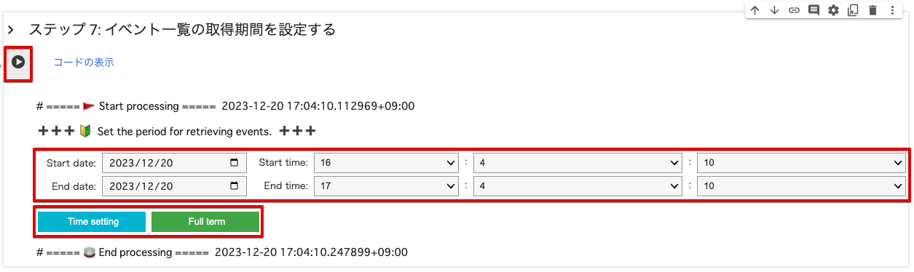

2. 以下の項目を入力します。

    | 項目 | 説明 |
    |-|-|
    | **[Start date]** | 開始日。例: `2023/05/02` |
    | **[Start time]** | 開始時刻。例: `10:33:31` |
    | **[End date]** | 終了日。例: `2023/05/02` |
    | **[End time]** | 終了時刻。例: `10:38:31` |

    > [!WARNING]
    > **開始日時と終了日時を設定してください**
    >     開始日時と終了日時の初期値は、どちらも実行した日時です。開始日時と終了日時を変更せずに **[Time setting]** をクリックすると、エラーが表示されます。
    >
    >     

3.  **[Time setting]** をクリックします。

    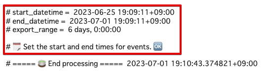

    イベントを取得する期間が設定されます。

    > [!NOTE]
    > **すべての期間を対象にする場合**
    >     記録されているすべてのイベントを対象にする場合は、開始日時と終了日時を設定せずに、**[Full term]** をクリックします。**[Start date]**、**[Start time]**、**[End date]**、および **[End time]** は使用されません。
    >
    >     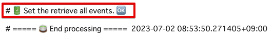

## ステップ 8: 設定した期間のイベントから 1 つ選択する {#select-event}

前のステップで設定した期間で、ソラカメ対応カメラがクラウドに記録したイベント一覧を取得して、イベントを 1 つ選択します。

> [!NOTE]
> **呼び出している SORACOM API**
>     このステップでは、以下の SORACOM API を呼び出しています。
>
>     | API | 説明 |
>     |-|-|
>     | [`SoraCam:listSoraCamDeviceEventsForDevice API`](https://users.soracom.io/ja-jp/tools/api/reference/#/SoraCam/listSoraCamDeviceEventsForDevice) | ソラカメ対応カメラのイベント一覧を取得する |

1. サンプルコードの **[ステップ 8]** の以下の項目を設定します。

    | 項目 | 説明 |
    |-|-|
    | **[streamable_events]** | ストリーミング再生できるイベントのみを表示する場合は、チェックを入れます。 |

1. サンプルコードの **[ステップ 8]** のコードセルにマウスポインターを合わせて **[▶]** をクリックします。

    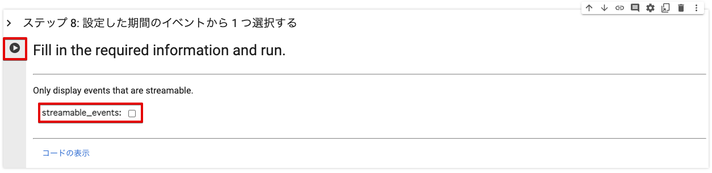

1. 実行結果に表示された **[🌈 Event List]** をクリックします。

    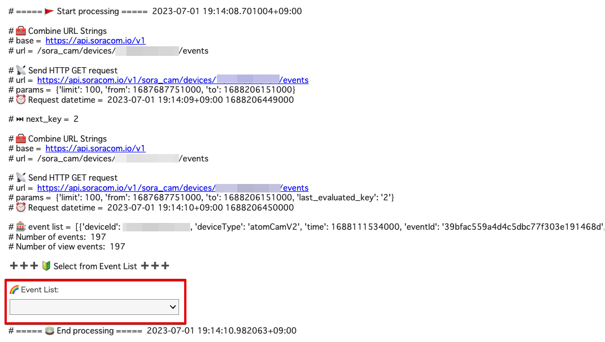

    1 行ごとに 1 つのイベント情報が、`日時 / イベントタイプ / イベントの録画状況 / イベント画像の有無 / イベント動画のストリーミング再生可否` の順に表示されます。

    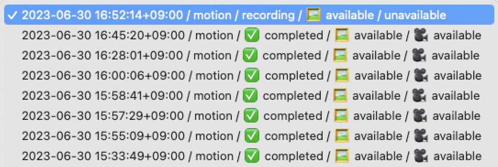

1. イベントを選択します。

    選択したイベントの情報 (JSON) が表示されます。

    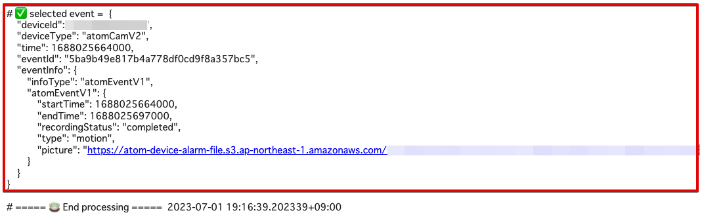

    > [!NOTE]
    >     イベント画像の有無と、イベント動画のストリーミング再生可否は、`eventInfo.atomEventV1` の以下のプロパティを確認しています。
    >     - `picture` の URL がある場合は、イベント画像があると判定しています。
    >     - `startTime` と `endTime` がある場合は、イベント動画がストリーミング再生できると判定しています。

## ステップ 9: 選択したイベントのストリーミング映像を再生する

前のステップで選択したイベントの動画を、[ストリーミング再生](https://users.soracom.io/ja-jp/docs/soracom-cloud-camera-services/watch-movie-stored-in-cloud/) します。再生するイベント動画の長さ分「動画のエクスポート可能時間」が消費されます。Colab 上で動画を再生することで、この後のステップで画像解析の対象物があるかどうかを確認します。

> [!NOTE]
> **呼び出している SORACOM API**
>     このステップでは、以下の SORACOM API を呼び出しています。
>
>     | API | 説明 |
>     |-|-|
>     | [`SoraCam:getSoraCamDeviceStreamingVideo API`](https://users.soracom.io/ja-jp/tools/api/reference/#/SoraCam/getSoraCamDeviceStreamingVideo) | ストリーミング映像 (最新映像 / 録画映像) をダウンロードするための情報を取得する |
>     | [`SoraCam:getSoraCamDeviceExportUsage API`](https://users.soracom.io/ja-jp/tools/api/reference/#/SoraCam/getSoraCamDeviceExportUsage) | ソラカメ対応カメラの静止画のエクスポート可能枚数や録画映像のエクスポート可能時間を取得する |

1. サンプルコードの **[ステップ 9]** のコードセルにマウスポインターを合わせて **[▶]** をクリックします。

    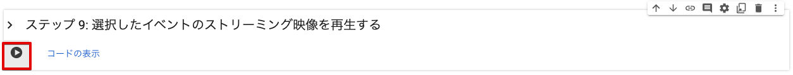

    ストリーミング再生用の URL が発行され、動画の再生が始まります。

    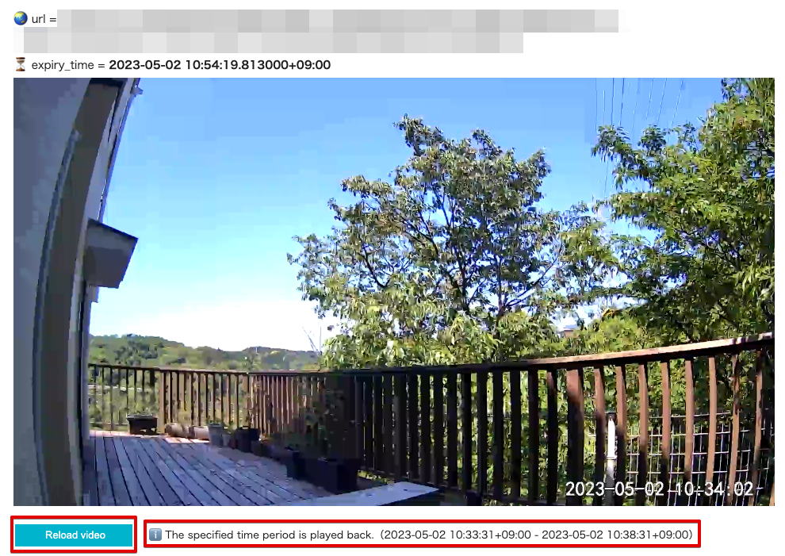

    > [!NOTE]
    > **URL には有効期限が設定されているため一定時間で再生が停止します**
    >     - ストリーミング再生用の URL には有効期限が設定されています。そのため、有効期限が経過してから再生バーを操作すると、動画は再生されません。
    >     - **[Reload video]** をクリックすると、同じイベント動画のストリーミング再生がもう一度行われます。「動画のエクスポート可能時間」が消費されます。

## ステップ 10: 選択したイベントの画像を取得する

選択したイベントの画像を取得します。取得した画像ファイルは Colab 内に保存されます。**この操作で「動画のエクスポート可能時間」は消費されません。**

1. サンプルコードの **[ステップ 10]** のコードセルにマウスポインターを合わせて **[▶]** をクリックします。

    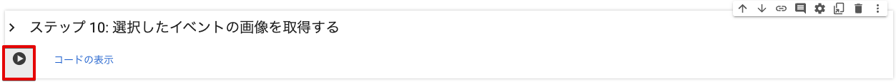

    静止画ファイル (jpg ファイル) が Colab 内にダウンロードされます。
    ダウンロードが正常に完了すると `The event image has been saved.` のようなメッセージが表示されます。

    

    > [!NOTE]
    > **イベント画像のダウンロード用 URL には有効期限が設定されているため一定時間で URL が失効します**
    >     - イベント画像のダウンロード用 URL には有効期限が設定されています。そのため、有効期限が経過してから上記の操作を行ってもダウンロードできません。
    >     - [ステップ 8: 設定した期間のイベントから 1 つ選択する](#select-event) から再実行してダウンロードしてください。

2.  をクリックします。

    「event_image」ディレクトリと、ダウンロードされたイベント画像ファイルが表示されます。

    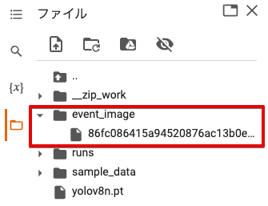

## ステップ 11: 取得したイベント画像を表示する

前のステップで Colab 内にダウンロードしたイベント画像を表示して確認します。

1. サンプルコードの **[ステップ 11]** のコードセルにマウスポインターを合わせて **[▶]** をクリックします。

    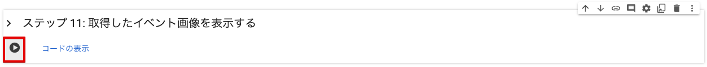

    実行結果にダウンロードしたイベント画像が表示されます。

    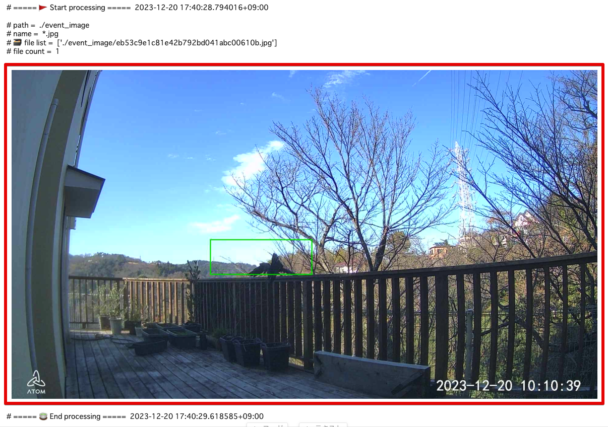

    > [!NOTE]
    >     イベント画像が正しく表示されない場合は  をクリックして画像ファイルを直接確認してください。

## ステップ 12: 取得したイベント画像を OpenAI で解析する

Colab 内にダウンロードしたイベント画像に対して、OpenAI ライブラリを利用して画像解析を行います。OpenAI のサービスである [ChatGPT](https://chat.openai.com/) と同様に、イベント画像に対して自然言語で質問や確認を行えます。

1. サンプルコードの **[ステップ 12]** のコードセルにマウスポインターを合わせて **[▶]** をクリックします。

    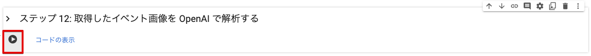

    実行結果に選択した AI モデル名称 (`# 🍺 AI Model =  gpt-4-vision-preview`) と AI モデルにインプットするイベント画像が表示されます。モデルの設定や自然言語で質問できる入力フォームが表示されます。

    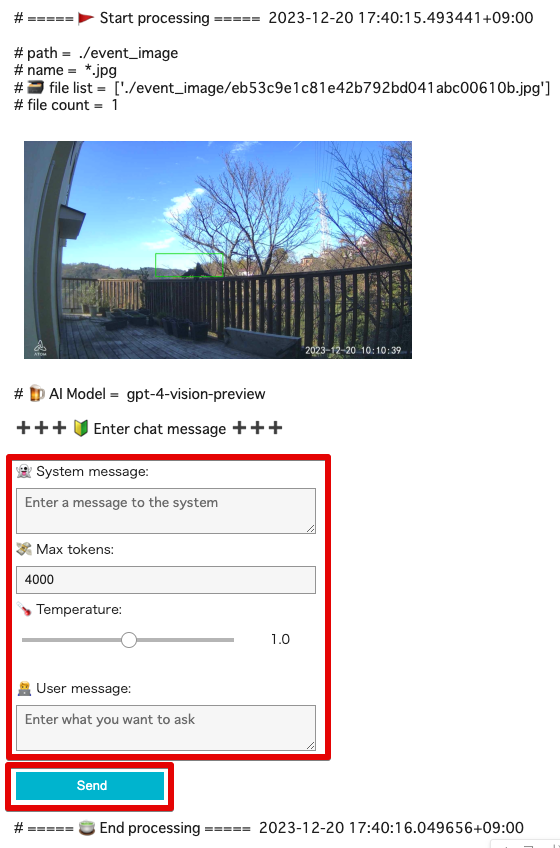

1. OpenAI API の [chat completion](https://platform.openai.com/docs/api-reference/chat/create) に引き渡す値を入力フォームに入力します。

    値の詳細については OpenAI の API リファレンスを確認してください。

    | 項目 | 説明 |
    |-|-|
    | **[👻 System message]** | `system` role に引き渡すメッセージを入力します。AI に特定の指示を行う場合に利用します。空欄でも動作します。 |
    | **[💸 Max tokens]** | `max_tokens` に引き渡す値を入力します。入力された数値が小さい場合は、AI からの回答が分割されることがあります。 |
    | **[🌡️ Temperature]** | `temperature` に引き渡す値を選択します。AI が生成するテキストのランダム性のレベルが指定できます。|
    | **[🧑‍💻 User message]** | `user` role に引き渡すメッセージを入力します。AI に指示する内容を入力します。必須入力です。 |

    通常利用する場合は **[🧑‍💻 User message]** に AI モデルに指示する内容のみを入力します。

1. **[Send]** をクリックします。

    実行結果に、AI モデルへ指示した内容と、AI モデルからの返答が表示されます。

    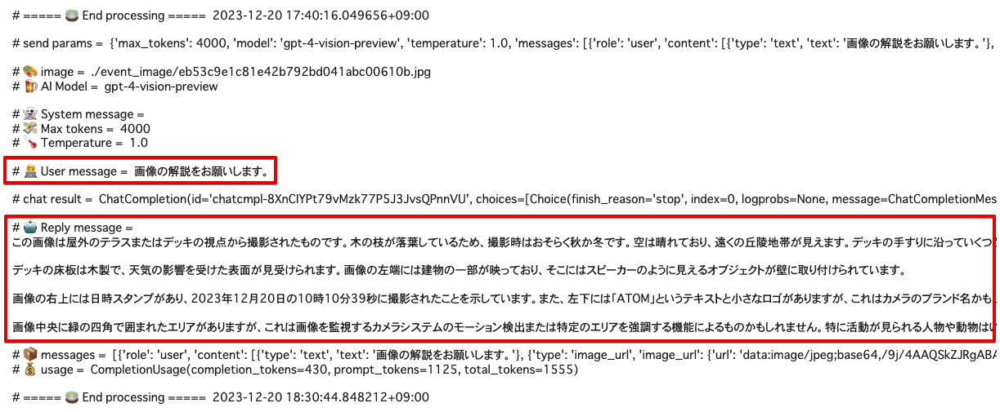

    `# 🧑‍💻 User message =  画像の解説をお願いします。` という指示に対して、以下のような返答が生成されました。

    ```
    # 🤖 Reply message = 
        この画像は屋外のテラスまたはデッキの視点から撮影されたものです。木の枝が落葉しているため、撮影時はおそらく秋か冬です。空は晴れており、遠くの丘陵地帯が見えます。デッキの手すりに沿っていくつかの鉢植えが置かれていますが、植物は寒い季節のためか成長していないように見えます。

        デッキの床板は木製で、天気の影響を受けた表面が見受けられます。画像の左端には建物の一部が映っており、そこにはスピーカーのように見えるオブジェクトが壁に取り付けられています。

        画像の右上には日時スタンプがあり、2023年12月20日の10時10分39秒に撮影されたことを示しています。また、左下には「ATOM」というテキストと小さなロゴがありますが、これはカメラのブランド名かもしれません。

        画像中央に緑の四角で囲まれたエリアがありますが、これは画像を監視するカメラシステムのモーション検出または特定のエリアを強調する機能によるものかもしれません。特に活動が見られる人物や動物はいないようです。
    ```

    > [!NOTE]
    >     返答は実行時に生成されているため、実行するごと異なる結果になることがあります。`max_tokens` の指定以上に長い返答の場合、返答が途中で途切れる可能性があります。その際には「続きお願いします」と言った指示をすることで、返答の続きを表示できます。

## ステップ 13: ダウンロード対象のディレクトリを選択する

これまでのステップで Colab 内に保存したファイルを、ローカル環境にダウンロードするための準備として、イベント画像ファイルが保存されているディレクトリを選択します。

1. サンプルコードの **[ステップ 13]** のコードセルにマウスポインターを合わせて **[▶]** をクリックします。

    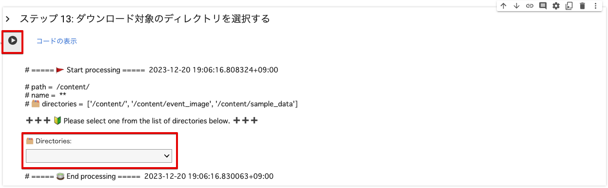

2. **[🗂️ Directories]** をクリックして、「/content/event_image」を選択します。

    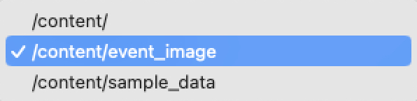

    `# 📄 File List` (ディレクトリ内のファイル一覧) が表示されます。

    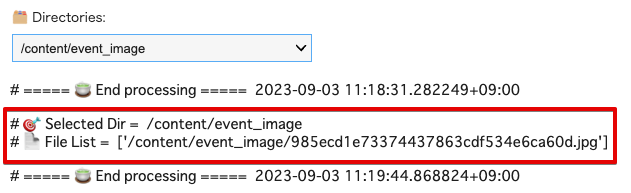

## ステップ 14: 選択したディレクトリをローカルにダウンロードする

Colab 内に保存したファイルしを zip 形式で圧縮して、ローカル環境にダウンロードします。

1. サンプルコードの **[ステップ 14]** のコードセルにマウスポインターを合わせて **[▶]** をクリックします。

    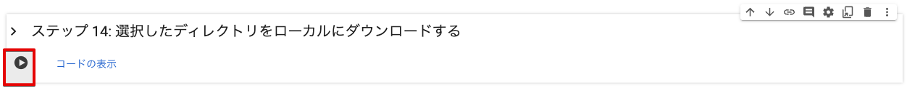

    前のステップで選択したディレクトリを zip 形式で圧縮したファイルがダウンロードされます。

    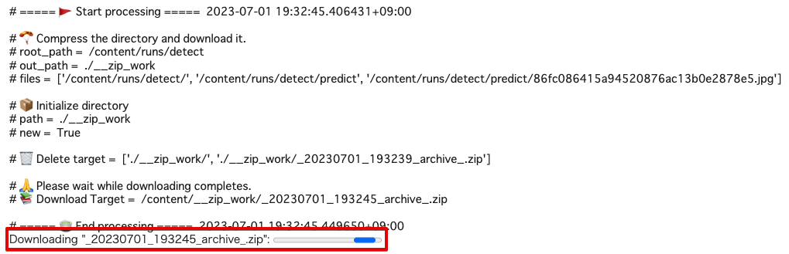

1. ローカル環境にダウンロードされた zip 形式で圧縮したファイルを展開して、イベント画像ファイルが表示できることを確認します。

    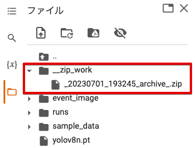

    上記の例では、`_20230701_193245_archive_.zip` という zip 形式のファイルがローカルにダウンロードされます。

    > [!NOTE]
    > **Colab 内のファイルとローカル環境のファイルを比較してください**
    >     「/content/__zip_work/」ディレクトリのすべてのファイルがローカル環境にダウンロードされていれば、実行は成功しています。
    >
    >     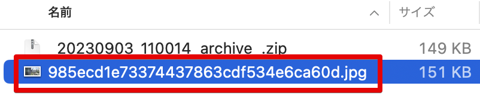
    >
    >     上記の例では、jpg ファイルが イベント画像のファイルです。
    >
    >     
    >
    >     なお、ブラウザの設定で複数ファイルのダウンロードが許可されていない場合は、上記のような表示が出ることがあります。表示内容を確認し、**[許可する]** をクリックして、ダウンロードを続行してください。

## まとめ

**[SORACOM API](https://users.soracom.io/ja-jp/tools/api/) と [OpenAI API](https://platform.openai.com/docs/guides/vision) を使って イベント画像を OpenAI で解析する** サンプルコードを Colab で体験できました。OpenAI のサービスである [ChatGPT](https://chat.openai.com/) と同様に、自然言語で指示を行えるので、ぜひいろいろなパターンを試してみてください。また、各ステップごとの解説とサンプルコードを参考に、実際のユースケースでも SORACOM API や OpenAI API を活用して、新しい使いかたや自動化、省力化にチャレンジしてください。

## (参考) サンプルコードを変更する場合

最後に参考として、サンプルコードを変更して実行する場合の簡単な Tips を紹介します。

> [!WARNING]
> **サンプルコードの利用について**
>     - サンプルコードは、API の使いかたを紹介することを目的として提供されています。SORACOM サポートではサポートを行いません。
>     - サンプルコードを実行したことによる利用者自身、もしくは第三者が被った損害に対して、直接的、間接的を問わず、株式会社ソラコムは責任を負いかねます。

### エクスポートした静止画を利用する

サンプルコードでは、イベント一覧から特定のイベントの画像を取得して利用しました。しかし、定点観測している場合は必ずしもイベントが記録されているとは限りません。その際もクラウドに保存された動画から静止画をエクスポートできれば、指定した日時の画像を自由に OpenAI API で解析できます。
静止画のエクスポートにつては、[タイムラプス動画を作成する](../creating-time-lapse-video/GUIDE.md) で実際に試すことができますので、確認してみてください。

### SORACOM API の API トークンの有効期限を変更する

サンプルコードでは、SORACOM API の API トークンの有効期限を「3600 秒 (1 時間)」に設定しています。有効期限を変更する場合には `authenticate_user()` を呼び出す際、引数 `timeout` に有効期限を設定してください。有効期限に指定できる範囲については、[`Auth:auth API`](https://users.soracom.io/ja-jp/tools/api/reference/#/Auth/auth) を参照してください。

```python
# /auth
# Authenticate API access and issue API key and API token
# https://users.soracom.io/ja-jp/tools/api/reference/#/Auth/auth
def authenticate_user(self, email: str, password: str, opid: str, name: str, mfa_code: str = None, timeout: int = 3600) -> APIResult:
    api_path = '/auth/'
    url = merge_url(self.endpoint_url, api_path)
    headers = {'Content-Type': 'application/json'}

    # authentication uses the following values
    # Root: email, password
    # SAM: opid, name, password
    data = dict()

    # prepare the value for the Root case
    if email != None and email != '':
        if password != None and password != '':
            data['email'] = email
            data['password'] = password

    # prepare the value for the SAM case
    # If both are valid, SAM is preferred
    if opid != None and opid != '':
        if name != None and name != '':
            if password != None and password != '':
                data['operatorId'] = opid
                data['userName'] = name
                data['password'] = password

    # set the API key expiration time (Default 1 hour)
    data['tokenTimeoutSeconds'] = timeout

    # MFA Authentication Code
    if mfa_code != None and mfa_code != '':
        data['mfaOTPCode'] = mfa_code

    # Send Request
    return send_post_request(url, headers=headers, data=data)
```

## (Tool) クラウドの録画状態を確認する

サンプルコード内では、[ステップ 7: イベント一覧を取得する期間を設定する ](#set-event-time) で期間を指定してイベント一覧を取得しています。ソラカメはネットワークを利用してクラウドへ録画を行っています。クラウド環境に実際にイベントや録画データがあるかどうかは、[SORACOM ユーザーコンソールで確認](https://users.soracom.io/ja-jp/docs/soracom-cloud-camera-services/watch-movie-stored-in-cloud/) できます。どちらの場合も動画の下に表示される `タイムラインバー` で録画状態を確認します。

ここでは、SORACOM API を使ってタイムラインバーの情報を取得して、Colab で情報を可視化しています。これで簡易的ではありますが、Colab だけで録画状態を確認できるため、期間の指定で困った場合に使ってみてください。

> [!WARNING]
> **クラウドの録画状態の確認について**
> - 録画状態を取得する場合には、ソラカメ対応カメラに [ライセンスを割り当てる](https://users.soracom.io/ja-jp/docs/soracom-cloud-camera-services/starting-cloud-always-recording/) 必要があります。
> - 利用中のライセンス種別によっては、録画状態が取得できない場合があります。

### (Tool) 1: 録画状態の取得期間を設定する

[ステップ 6: カメラを 1 台選択する](#select-camera) の実行が終了し、ソラカメ対応カメラを 1 台選択した状態で実行します。
選択したソラカメ対応カメラが、クラウドへ記録したデータとイベントの状態を取得するための取得期間を設定します。

1. サンプルコードの **[(Tool) 1]** のコードセルにマウスポインターを合わせて **[▶]** をクリックします。

    **[Start date]** などの入力欄が表示されます。

    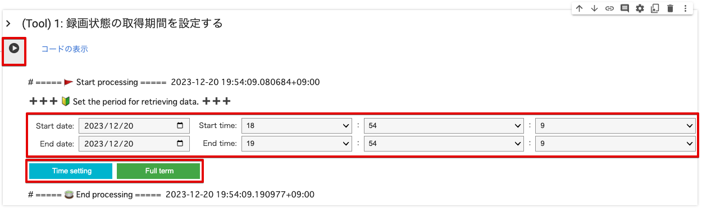

2. 以下の項目を入力します。

    | 項目 | 説明 |
    |-|-|
    | **[Start date]** | 開始日。例: `2023/05/02` |
    | **[Start time]** | 開始時刻。例: `10:33:31` |
    | **[End date]** | 終了日。例: `2023/05/02` |
    | **[End time]** | 終了時刻。例: `10:38:31` |

    > [!WARNING]
    > **開始日時と終了日時を設定してください**
    >     開始日時と終了日時の初期値は、どちらも実行した日時です。開始日時と終了日時を変更せずに **[Time setting]** をクリックすると、エラーが表示されます。
    >
    >     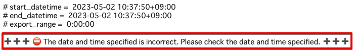

3.  **[Time setting]** をクリックします。

    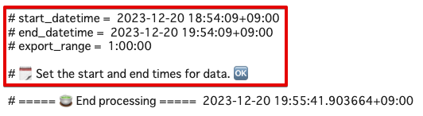

    録画状態を取得する期間が設定されます。

    > [!NOTE]
    > **すべての期間を対象にする場合**
    >     記録されているすべての期間を対象にする場合は、開始日時と終了日時を設定せずに、**[Full term]** をクリックします。**[Start date]**、**[Start time]**、**[End date]**、および **[End time]** は使用されません。
    >
    >     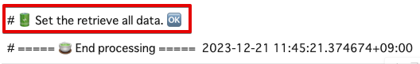

### (Tool) 2: 設定した期間の録画状態を取得する

前のステップで設定した期間で、ソラカメ対応カメラがククラウドへ記録したデータとイベントの状態を取得します。

> [!NOTE]
> **呼び出している SORACOM API**
>     このステップでは、以下の SORACOM API を呼び出しています。
>
>     | API | 説明 |
>     |-|-|
>     | [`SoraCam:listSoraCamDeviceRecordingsAndEvents API`](https://users.soracom.io/ja-jp/tools/api/reference/#/SoraCam/listSoraCamDeviceRecordingsAndEvents) | ソラカメ対応カメラが録画した期間の一覧およびイベントの一覧を取得する |

1. サンプルコードの **[(Tool) 2]** のコードセルにマウスポインターを合わせて **[▶]** をクリックします。

    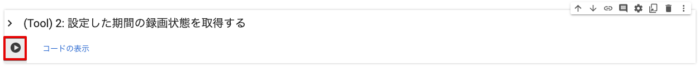

1. 実行結果に取得結果が表示されます。

    選択したソラカメ対応カメラの指定した期間で取得した録画状態が表示されています。`record list` が録画状態、`event list` がイベント一覧です。

    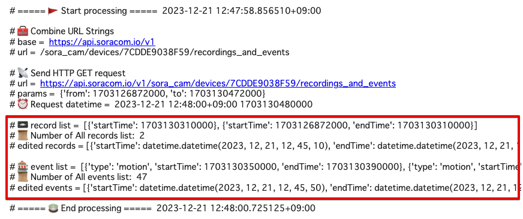

### (Tool) 3: 取得した録画状態を表示する

前のステップで取得したデータを、グラフとして表示することで、指定した期間中の録画状態を俯瞰して確認できます。

1. サンプルコードの **[(Tool) 3]** のコードセルにマウスポインターを合わせて **[▶]** をクリックします。

    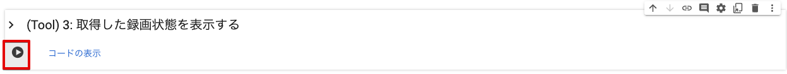

1. 実行結果にグラフが表示されます。

     **選択したカメラの録画状態:**

     線が表示されている期間で、クラウドに動画が保存されていることを表します。

    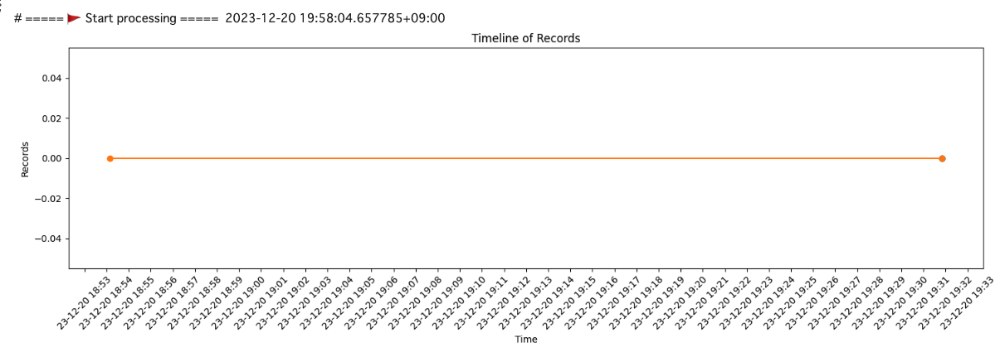

    **選択したカメラのイベント録画状態:**

     線が表示されている期間で、イベントが検知されたことを表します。

    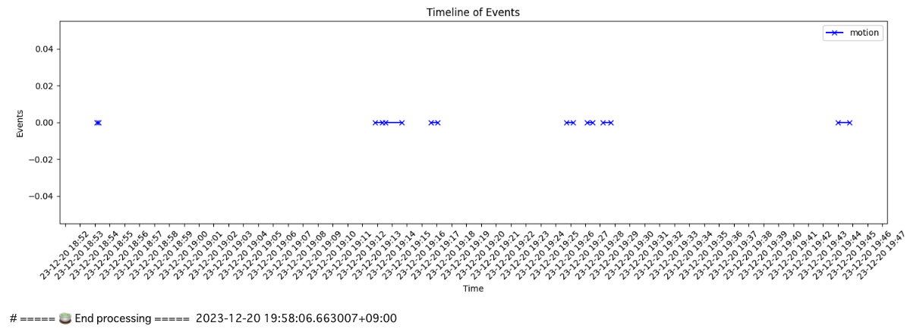
