# 15 分を超える動画をダウンロードする

> [!IMPORTANT]
> このサンプルは、アーカイブ済みリポジトリ内の参照用コンテンツです。
>
> - このリポジトリの更新は終了しています。
> - ソラカメに関する最新情報は [sora-cam.com](https://sora-cam.com/) を確認してください。
> - SORACOM API、Google Colab、Python パッケージ、外部 API の変更により、ノートブックが動作しなくなる可能性があります。

ユーザーコンソールを利用した場合も、[SORACOM API](https://users.soracom.io/ja-jp/tools/api/) (以下、API) を利用した場合も、動画のエクスポートには **1 回あたり最大 15 分間の制限** があります。そのため、15 分を超える動画をダウンロードするには、15 分ごとに動画をダウンロードしてから、それらを 1 つのファイルとして結合するなど工夫をする必要があります。

たとえば、毎回決まって行うルーティーン作業をソラカメ対応カメラで撮影していて、その作業が 15 分を超える場合、ユーザーコンソールで録画の確認を行うと、複数回の手動操作が必要です。API を使うことで、手動操作よりも効果的に、作業の自動化や省力化が行えます。

ここでは、API を使ったサンプルコードを実行することで、指定された 15 分を超える範囲の動画をダウンロードして、1 つのファイルとして結合することを体験できます。サンプルコードは、[Colaboratory](https://colab.research.google.com/)(以下、Colab) を使って実行します。

> [!CAUTION]
> **Colaboratory はソラコムが提供するサービスではありません**
> - Colaboratory の利用には Google アカウントが必要です。
> - ソラコムは、Colaboratory に関するサポートを行いません。
> - Colaboratory については、Colaboratory の運営会社へ [お問い合わせ](https://research.google.com/colaboratory/faq.html) ください。

> [!WARNING]
> **サンプルコードの利用について**
> - サンプルコードでは、API を使って録画データを操作するため、[クラウドに動画が保存](https://users.soracom.io/ja-jp/docs/soracom-cloud-camera-services/watch-movie-stored-in-cloud/) されている必要があります。
> - サンプルコードの実行には SORACOM ユーザーコンソールの [ログイン情報](https://users.soracom.io/ja-jp/docs/user-console/log-in-to-user-console/) が必要です。
> - サンプルコードでは、実際に動画や静止画のエクスポートを行うため、[動画のエクスポート可能時間](https://users.soracom.io/ja-jp/docs/soracom-cloud-camera-services/set-monthly-limit/) が消費されます。
> - サンプルコードは、API の使いかたを紹介することを目的として提供されています。SORACOM サポートではサポートを行いません。
> - サンプルコードを実行したことによる利用者自身、もしくは第三者が被った損害に対して、直接的、間接的を問わず、株式会社ソラコムは責任を負いかねます。

<details>
<summary>操作を始める前に準備が必要です (クリックして確認してください)</summary>

#### (1) サンプルコードを実行するための環境を準備する

ソラカメ対応カメラでクラウドに録画した映像を、SORACOM API を使って操作できることを確認してください。詳しくは、[API の使いかたについて](../about-api-examples/README.md) を参照してください。


**準備完了**
</details>

## サンプルコード

このページで使用するサンプルコードです。

  - [ api-examples-download-videos-longer-than-limits.ipynb](https://colab.research.google.com/github/soracom-labs/sora-cam-api-examples/blob/main/download-videos-longer-than-limits/api-examples-download-videos-longer-than-limits.ipynb)

リンクをクリックして Colab で開いて、ガイドページに沿って体験してください。

> [!NOTE]
> **警告が表示されることがあります**
> - GitHub からサンプルコードを実行する際、「警告: このノートブックは Google が作成したものではありません。」と表示されることがあります。表示された内容を確認して、**[このまま実行]** をクリックしてください。
>
>     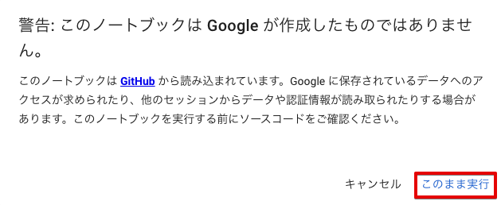
>
> - GitHub から実行したサンプルコードを修正して保存する際、「変更を保存できませんでした」と表示されることがあります。保存する場合には表示された内容を確認して、**[ドライブにコピーを保存]** をクリックしてください。ログインしている Google アカウントの Google ドライブ にノートブックのコピーが保存されます。
>
>     

## ステップ 1: サンプルコードの実行に必要なライブラリや定数を設定する

サンプルコード全体で利用するライブラリや関数、定数の定義を行います。ここで定義された内容は、他のコードセルでも利用できます。

1. サンプルコードの **[ステップ 1]** のコードセルにマウスポインターを合わせて **[▶]** クリックします。

    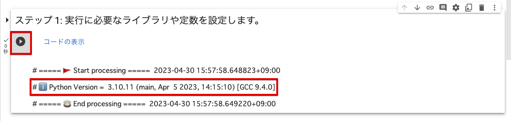

    実行結果に Python のバージョン (例: `# ℹ️ Python Version =  3.10.11 (main, Apr  5 2023, 14:15:10) [GCC 9.4.0]`) が表示されます。

## ステップ 2: SORACOM API を使うための認証処理をする

[SORACOM API](https://users.soracom.io/ja-jp/tools/api/) を使うための認証処理を行います。ユーザーコンソールのログイン情報を入力するフォームに必要な情報を入力して、**[Login]** をクリックすると SORACOM API の認証処理が実行され、このステップ以降で SORACOM API が実行できます。

> [!NOTE]
> **呼び出している SORACOM API**
> このステップでは、以下の SORACOM API を呼び出しています。
> | API | 説明 |
> |-|-|
> | [`Auth:auth API`](https://users.soracom.io/ja-jp/tools/api/reference/#/Auth/auth) | API アクセスの認証を行い、API キーと API トークンを発行する |

1. サンプルコードの **[ステップ 2]** の以下の項目を設定します。

    | 項目 | 説明 |
    |-|-|
    | **[endpoint_url]** | [SORACOM API の日本カバレッジのエンドポイント](https://users.soracom.io/ja-jp/tools/api/endpoints/) (`https://api.soracom.io/v1`) を入力します。 |
    | **[login_type]** | SORACOM API を利用するユーザーの種別を選択します。具体的なログイン情報は、手順 3 で入力します。<br><br>- Root User: ルートユーザーのログイン情報が分かる場合<br>- SAM User: SAM ユーザーのログイン情報が分かる場合 |
    | **[use_mfa]** | 多要素認証 (Multi-Factor Authentication: MFA) を有効化しているユーザーの場合はチェックします。<br><br>具体的なワンタイムパスワード (Time-based One-Time Password: TOTP) 情報は、手順 3 で入力します。 |

2. サンプルコードの **[ステップ 2]** のコードセルにマウスポインターを合わせて **[▶]** クリックします。

    


    実行結果にログイン情報の入力フォームが表示されます。

3. ログイン情報を入力して、**[Login]** をクリックします。

    - 手順 2 の **[login_type]** で「Root User」を選択した場合は、ルートユーザーのメールアドレスとパスワードを入力します。

        

    - 手順 2 の **[login_type]** で「SAM User」を選択した場合は、SAM ユーザーが所属するオペレーターのオペレーター ID、SAM ユーザー名、パスワードを入力します。

        

    - 手順 2 の **[use_mfa]** をチェックした場合は、MFA 認証コードを入力します。

        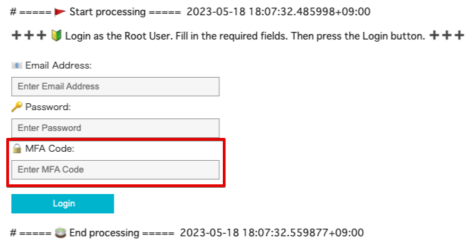

    正しい認証情報を入力していれば、`# 🔑 API access has been authenticated 💯` と表示され、入力欄が初期化されます。

    


## ステップ 3: カメラを 1 台選択する

ソラカメ対応カメラの一覧を取得し、そこからソラカメ対応カメラを 1 台選択します。このステップ以降では、ここで選択したソラカメ対応カメラがクラウドに保存した動画や画像に対して、API で操作を行います。

> [!NOTE]
> **呼び出している SORACOM API**
> このステップでは、以下の SORACOM API を呼び出しています。
>
> | API | 説明 |
> |-|-|
> | [`SoraCam:listSoraCamDevices API`](https://users.soracom.io/ja-jp/tools/api/reference/#/SoraCam/listSoraCamDevices) | ソラカメ対応カメラの一覧を取得する |
> | [`SoraCam:getSoraCamDevice API`](https://users.soracom.io/ja-jp/tools/api/reference/#/SoraCam/getSoraCamDevice) | ソラカメ対応カメラの情報を取得する |
> | [`SoraCam:getSoraCamDeviceExportUsage API`](https://users.soracom.io/ja-jp/tools/api/reference/#/SoraCam/getSoraCamDeviceExportUsage) | ソラカメ対応カメラの静止画のエクスポート可能枚数や録画映像のエクスポート可能時間を取得する |

1. サンプルコードの **[ステップ 3]** のコードセルにマウスポインターを合わせて **[▶]** クリックします。

    

2. 実行結果に表示された **[📷 Camera List]** をクリックします。

    1 行ごとに 1 台のソラカメ対応カメラの情報が、`名前 / 状態 / ファームウェアバージョン / 製品名 / デバイス ID` の順に表示されます。

    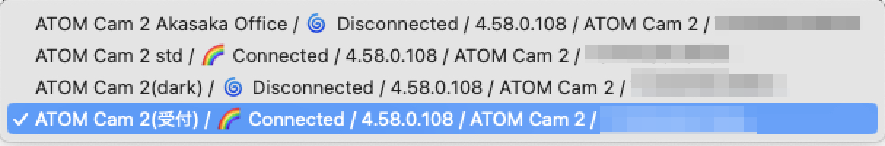

3. ソラカメ対応カメラを選択します。

    選択したソラカメ対応カメラの詳細情報 (JSON) と、選択したカメラのエクスポート可能時間 (JSON および `🔎 Time remaining of month =  72 hours 0 minutes 0 seconds`) が表示されます。

    **選択したカメラの詳細情報:**

    

    **選択したカメラのエクスポート可能時間:**

    

    > [!WARNING]
    > `Time remaining of month` が、選択したカメラの「今月の残り時間」です。`72 hours 0 minutes 0 seconds` と表示されている場合は、今月はあと 72 時間分の動画をエクスポートできます。このあとのステップで今月の残り時間を超えると、サンプルコードが動作しない可能性があります。必要に応じて、動画のエクスポート可能時間の上限を設定してください。詳しくは、[動画のエクスポート可能時間の上限を設定する](https://users.soracom.io/ja-jp/docs/soracom-cloud-camera-services/set-monthly-limit/) を参照してください。

## ステップ 4: ストリーミング再生の開始時刻と終了時刻を設定する

このステップと次のステップでは、前のステップで選択したソラカメ対応カメラがクラウドに録画した動画を、ストリーミング再生します。Colab で動画を再生することで、クラウドに録画された動画を、API で操作できることを確認できます。

> [!WARNING]
> **SORACOM API の仕様に従って動作するステップです**
> このステップと次のステップで行うストリーミング再生は、SORACOM API の仕様に従って動作します。したがって、再生可能時間は最大 900 秒 (15 分) です。

> [!NOTE]
> **呼び出している SORACOM API**
> このステップでは、以下の SORACOM API を呼び出しています。
>
> | API | 説明 |
> |-|-|
> | [`SoraCam:getSoraCamDeviceExportUsage API`](https://users.soracom.io/ja-jp/tools/api/reference/#/SoraCam/getSoraCamDeviceExportUsage) | ソラカメ対応カメラの静止画のエクスポート可能枚数や録画映像のエクスポート可能時間を取得する |

1. サンプルコードの **[ステップ 4]** のコードセルにマウスポインターを合わせて **[▶]** クリックします。

    **[Start date]** などの入力欄が表示されます。

    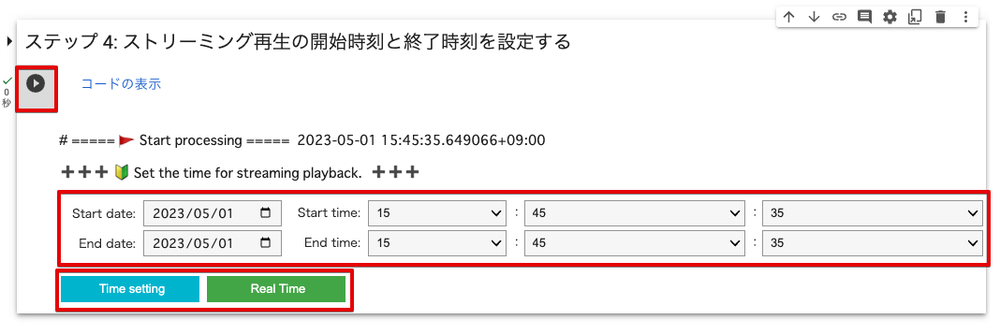

2. 以下の項目を入力します。

    | 項目 | 説明 |
    |-|-|
    | **[Start date]** | 開始日。例: `2023/05/02` |
    | **[Start time]** | 開始時刻。例: `10:33:31` |
    | **[End date]** | 終了日。例: `2023/05/02` |
    | **[End time]** | 終了時刻。例: `10:38:31` |

    > [!WARNING]
    > **開始日時と終了日時を設定してください**
    > - 開始日時と終了日時の初期値は、どちらも実行した日時です。開始日時と終了日時を変更せずに **[Time setting]** をクリックすると、エラーが表示されます。
    >
    >     
    > - 開始日時から終了日時の間隔は、最大 900 秒 (15 分) です。

3.  **[Time setting]** をクリックします。

    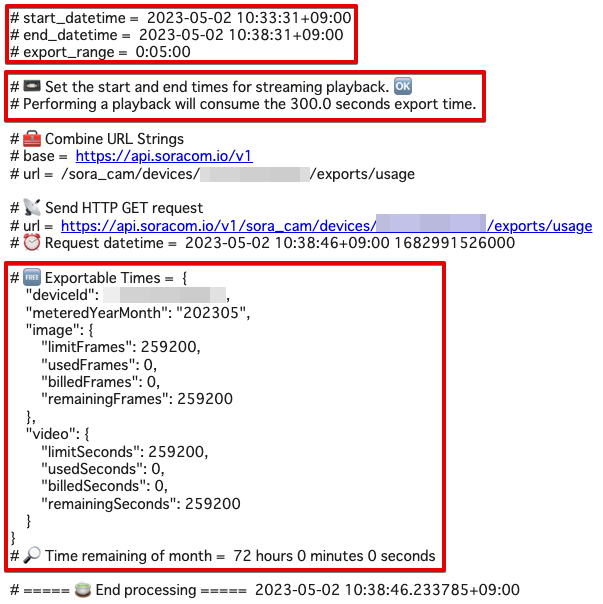

    > [!NOTE]
    > **最新映像をストリーミング再生することもできます**
    > 最新映像を再生する場合は、開始日時と終了日時を設定せずに、**[Real Time]** をクリックします。**[Start date]**、**[Start time]**、**[End date]**、および **[End time]** は使用されません。
    >
    > 

## ステップ 5: 設定した開始時刻と終了時刻でストリーミング再生する

選択したソラカメ対応カメラの開始時刻と終了時刻の範囲の動画を、[ストリーミング再生](https://users.soracom.io/ja-jp/docs/soracom-cloud-camera-services/watch-movie-stored-in-cloud/) します。指定した時間の分「動画のエクスポート可能時間」が消費されます。

> [!NOTE]
> **呼び出している SORACOM API**
> このステップでは、以下の SORACOM API を呼び出しています。
>
> | API | 説明 |
> |-|-|
> | [`SoraCam:getSoraCamDeviceStreamingVideo API`](https://users.soracom.io/ja-jp/tools/api/reference/#/SoraCam/getSoraCamDeviceStreamingVideo) | ストリーミング映像 (最新映像 / 録画映像) をダウンロードするための情報を取得する |
> | [`SoraCam:getSoraCamDeviceExportUsage API`](https://users.soracom.io/ja-jp/tools/api/reference/#/SoraCam/getSoraCamDeviceExportUsage) | ソラカメ対応カメラの静止画のエクスポート可能枚数や録画映像のエクスポート可能時間を取得する |

1. サンプルコードの **[ステップ 5]** のコードセルにマウスポインターを合わせて **[▶]** クリックします。

    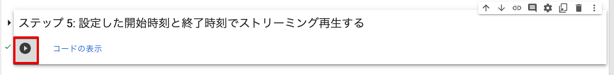

    ストリーミング再生用の URL が発行され、動画の再生が始まります。

    

    > [!NOTE]
    > **最新映像をストリーミング再生することもできます**
    > 最新映像をストリーミング再生する場合は、`ℹ️ Real-time video is playing.` と表示されます。
    >
    > 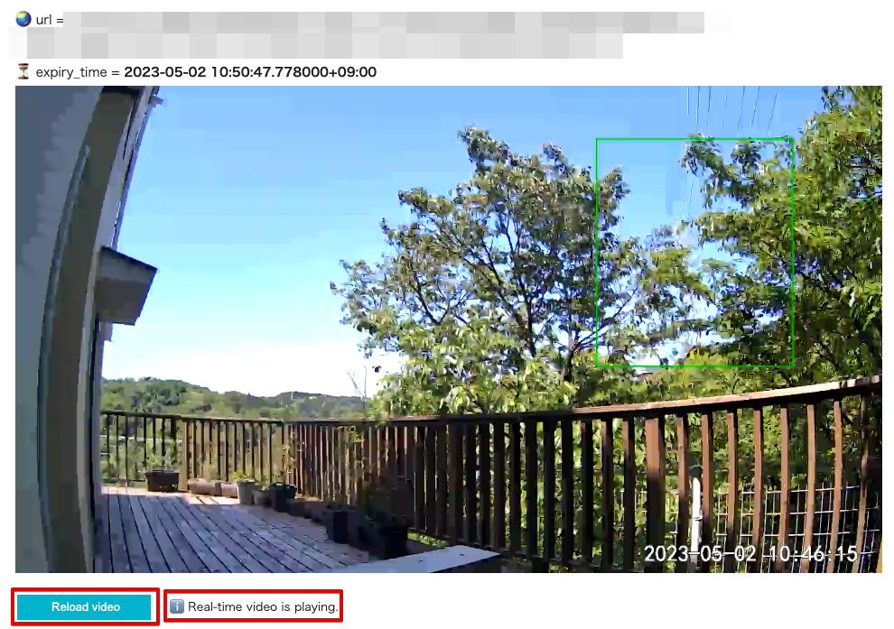

    > [!NOTE]
    > **URL には有効期限が設定されているため一定時間で再生が停止します**
    > - ストリーミング再生用の URL には有効期限が設定されています。そのため、有効期限が経過してから再生バーを操作すると、動画は再生されません。
    > - **[Reload video]** をクリックすると、ストリーミング再生が再開され、「動画のエクスポート可能時間」が消費されます。
    >     - 開始日時と終了日時を設定して **[Time setting]** をクリックした場合は、**[Reload video]** をクリックすると、設定した開始時間と終了時間の動画をもう一度再生します。
    >     - 最新映像を再生した場合は、**[Reload video]** をクリックすると、クリックした時点の最新の動画が再生されます。

## ステップ 6: 動画ダウンロードの開始時刻と終了時刻を設定する

このステップと次のステップでは、選択したソラカメ対応カメラがクラウドに録画した動画をダウンロードします。

> [!WARNING]
> **SORACOM API の仕様を超えて動作するステップです**
> このステップと次のステップで行うダウンロードは、**SORACOM API の仕様を超えて** 動作します。ユーザーコンソールでダウンロードする場合は、1 回のダウンロードで **最大 15 分間** の制限があります。ここでは、15 分を超える範囲を設定した場合、15 分単位で分割して複数の動画データをダウンロードします。たとえば、17 分間と指定した場合は、15 分間の動画と 2 分間の動画をダウンロードします。

> [!NOTE]
> **呼び出している SORACOM API**
> このステップでは、以下の SORACOM API を呼び出しています。
>
> | API | 説明 |
> |-|-|
> | [`SoraCam:getSoraCamDeviceExportUsage API`](https://users.soracom.io/ja-jp/tools/api/reference/#/SoraCam/getSoraCamDeviceExportUsage) | ソラカメ対応カメラの静止画のエクスポート可能枚数や録画映像のエクスポート可能時間を取得する |

1. サンプルコードの **[ステップ 6]** のコードセルにマウスポインターを合わせて **[▶]** クリックします。

    **[Start date]** などの入力欄が表示されます。

    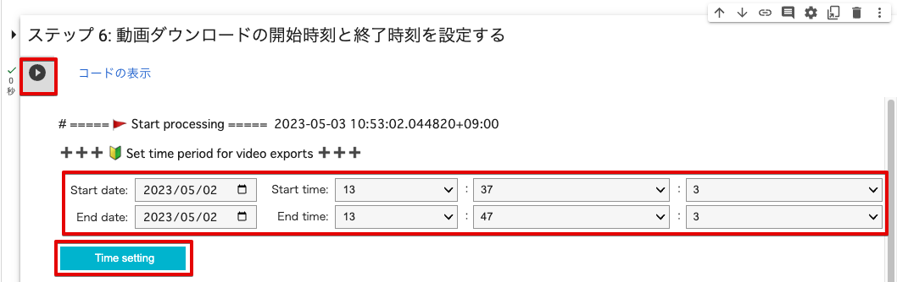

2. 以下の項目を入力します。

    | 項目 | 説明 |
    |-|-|
    | **[Start date]** | 開始日。例: `2023/05/02` |
    | **[Start time]** | 開始時刻。例: `10:33:31` |
    | **[End date]** | 終了日。例: `2023/05/02` |
    | **[End time]** | 終了時刻。例: `10:38:31` |

    > [!WARNING]
    > **開始日時と終了日時を設定してください**
    > 開始日時と終了日時の初期値は、どちらも実行した日時です。開始日時と終了日時を変更せずに **[Time setting]** をクリックすると、エラーが表示されます。
    >
    > 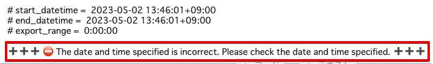

3.  **[Time setting]** をクリックします。

    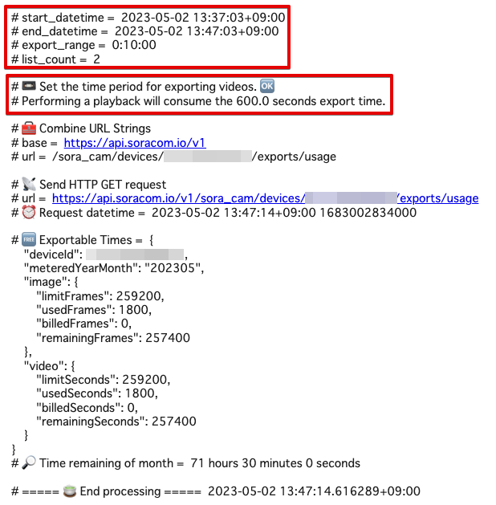

    - `# export_range =  0:10:00` は、ダウンロードされる動画の合計の長さです。この時間の分、「動画のエクスポート可能時間」が消費されます。
    - `# list_count =  2` は、次のステップでダウンロードされる動画ファイルの個数です。15 分単位でダウンロードされます。

## ステップ 7: 設定した開始時刻と終了時刻で動画をダウンロードする

選択したソラカメ対応カメラの開始時刻と終了時刻の範囲の [動画をダウンロード](https://users.soracom.io/ja-jp/docs/soracom-cloud-camera-services/download-movie-or-picture/) します。ダウンロード先は Colab 内です。指定した時間の分「動画のエクスポート可能時間」が消費されます。

> [!NOTE]
> **呼び出している SORACOM API**
> このステップでは、以下の SORACOM API を呼び出しています。
>
> | API | 説明 |
> |-|-|
> | [`SoraCam:exportSoraCamDeviceRecordedVideo API`](https://users.soracom.io/ja-jp/tools/api/reference/#/SoraCam/exportSoraCamDeviceRecordedVideo) | クラウドに保存された録画映像をエクスポートする処理を開始する |
> | [`SoraCam:getSoraCamDeviceExportedVideo API`](https://users.soracom.io/ja-jp/tools/api/reference/#/SoraCam/getSoraCamDeviceExportedVideo) | クラウドに保存された録画映像をエクスポートする処理の現在の状況を取得する |

1. サンプルコードの **[ステップ 7]** のコードセルにマウスポインターを合わせて **[▶]** クリックします。

    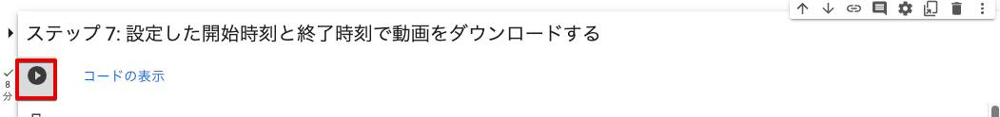

    実行結果に動画のエクスポートの状況が表示されます。

    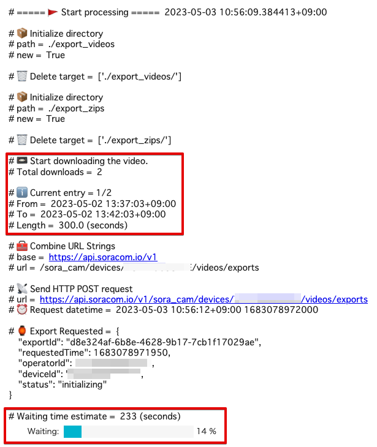

    録画された動画がエクスポートされますが、すぐにはダウンロードできません。サンプルコードでは、動画の長さに対してある程度の時間待つことと、エクスポートされた動画がダウンロードできるようになったことを確認する動作を繰り返しています。

    1 つの動画がダウンロードできるようになると、zip 形式で圧縮した動画ファイルが Colab 内にダウンロードされ、自動的に展開されて Colab 内に mp4 ファイルが保存されます。

    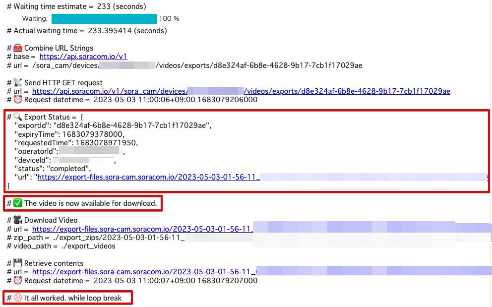

    > [!NOTE]
    > 動画を複数個ダウンロードする場合は、動画のダウンロードに有効期限があるため、動画ファイルごとにエクスポートとダウンロードを繰り返します。

2.  をクリックします。

    「export_videos」ディレクトリと、mp4 ファイルが表示されます。

    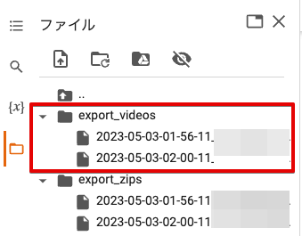

## ステップ 8: ローカル環境にダウンロードするディレクトリを選択する

これまでのステップで Colab 内に保存したファイルを、ローカル環境にダウンロードするための準備として、mp4 ファイルが保存されているディレクトリを選択します。

1. サンプルコードの **[ステップ 8]** のコードセルにマウスポインターを合わせて **[▶]** クリックします。

    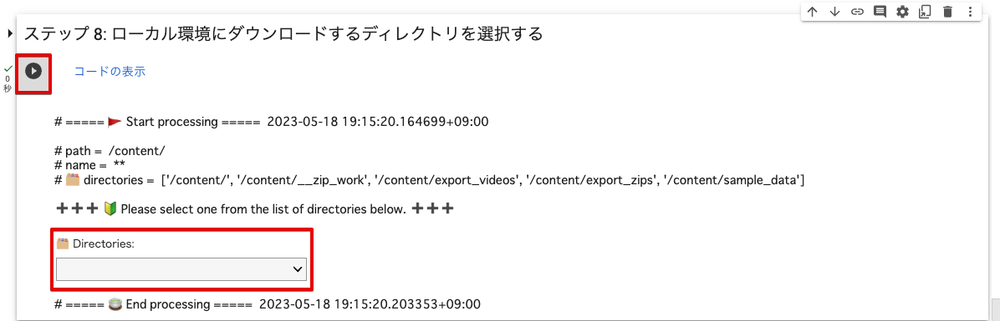

2. **[🗂️ Directories]** をクリックして、「/content/export_videos」を選択します。

    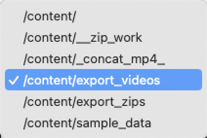

    `# 📄 File List` (ディレクトリ内のファイル一覧) が表示されます。

    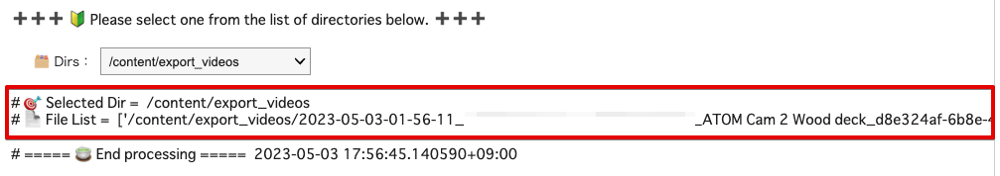

## ステップ 9: 選択したディレクトリをローカル環境にダウンロードする

Colab 内に保存したファイルしを zip 形式で圧縮して、ローカル環境にダウンロードします。

1. 複数の動画ファイルを結合する場合は、**[concat_mp4_videos]** にチェックを入れます。

    **[concat_mp4_videos]** にチェックを入れると、複数の動画ファイルを 1 つのファイルに結合した動画ファイルもあわせてダウンロードできます。

2. サンプルコードの **[ステップ 9]** のコードセルにマウスポインターを合わせて **[▶]** クリックします。

    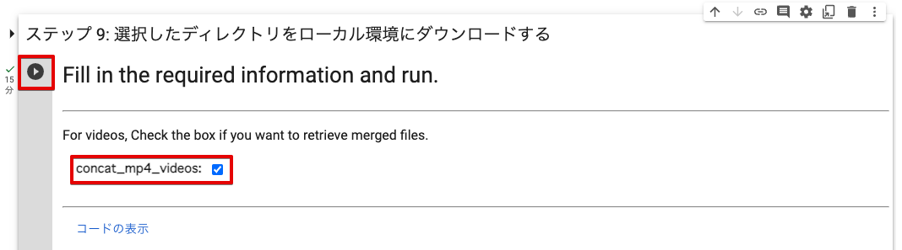

    前のステップで選択したディレクトリを zip 形式で圧縮したファイルがダウンロードされます。

    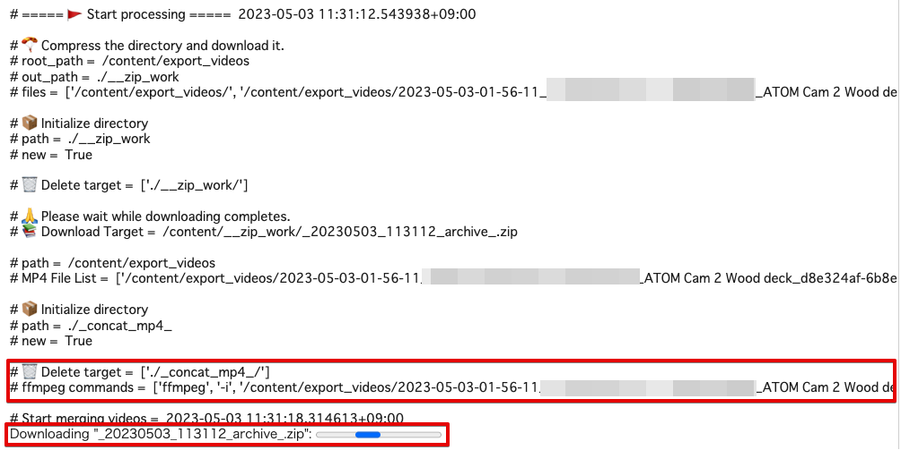

    > [!NOTE]
    > **[concat_mp4_videos] にチェックを入れたときは**
    > Colab にインストールされている [FFmpeg](https://ffmpeg.org/) を使って、複数の動画ファイルが 1 つのファイルに結合されます。
    >
    > 動画ファイルの結合が終了すると、実行結果に結合にかかった時間と FFmpeg の実行ログが表示されてから、ダウンロードされます。なお、ファイルを結合するために、動画を再エンコードするため時間がかかります。
    >
    > 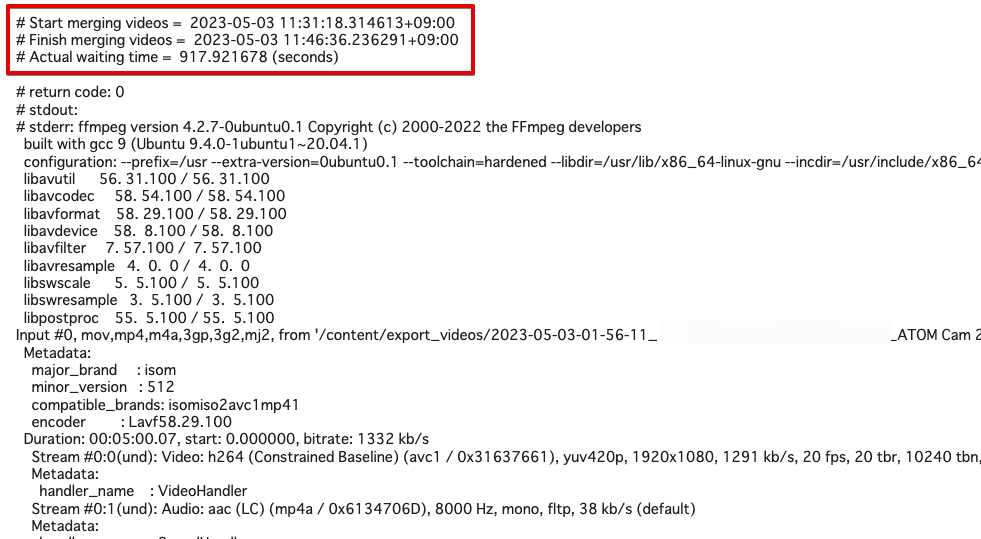

3. ローカル環境にダウンロードされた zip 形式で圧縮したファイルを展開して、mp4 ファイルが再生できることを確認します。

    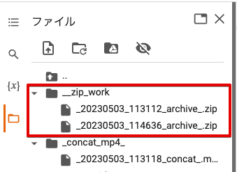

    上記の例では、`_20230503_113112_archive_.zip` と `_20230503_114636_archive_.zip` の 2 つの zip 形式のファイルがローカルにダウンロードされます。
    
    > [!NOTE]
    > **Colab 内のファイルとローカル環境のファイルを比較してください**
    > 「/content/__zip_work/」ディレクトリのすべてのファイルがローカル環境にダウンロードされていれば、実行は成功しています。
    >
    > 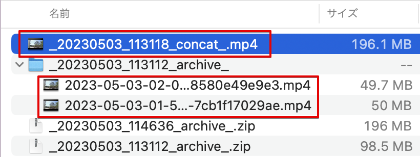
    >
    > 上記の例では、`_20230503_113118_concat_.mp4` ファイルが **[concat_mp4_videos]** にチェックを入れて結合されたファイルです。その他 2 つの mp4 ファイルは、結合する前のそれぞれの動画ファイルです。
    >
    > 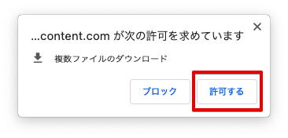
    >
    > なお、ブラウザの設定で複数ファイルのダウンロードが許可されていない場合は、上記のような表示が出ることがあります。表示内容を確認し、**[許可する]** をクリックして、ダウンロードを続行してください。

## まとめ

[SORACOM API](https://users.soracom.io/ja-jp/tools/api/) を使って、ユーザーコンソールでは実現できない **15 分を超える動画をダウンロードする** サンプルコードを Colab で体験できました。ステップごとの解説とサンプルコードを参考に、実際のユースケースでも API を活用して、新しい使いかたや自動化、省力化にチャレンジしてください。

## (参考) サンプルコードを変更する場合

最後に参考として、サンプルコードを変更して実行する場合の簡単な Tips を紹介します。

> [!WARNING]
> **サンプルコードの利用について**
> - サンプルコードは、API の使いかたを紹介することを目的として提供されています。SORACOM サポートではサポートを行いません。
> - サンプルコードを実行したことによる利用者自身、もしくは第三者が被った損害に対して、直接的、間接的を問わず、株式会社ソラコムは責任を負いかねます。

### 任意の時間単位で動画を分割してダウンロードする

サンプルコードでは、SORACOM API の制限に合わせて動画のダウンロード単位を 15 分 (900 秒) 単位にしています。15 分以内の任意の時間単位を利用する場合は、サンプルコードの `EXPORT_RANGE_LIMIT_SECONDS: Final = 900` の `900` を変更してください。

```python
# Export Time Management Class
class ExportTimeInfo():
    time_from: datetime
    time_to: datetime

    def init_vars(self):
        self.time_from = None
        self.time_to = None

    def valid_vars(self) -> bool:
        return True if self.time_from != None and self.time_to != None else False

    def __init__(self, time_from: datetime, time_to: datetime):
        self.init_vars()
        self.time_from = time_from
        self.time_to = time_to

    def __get_range_limit(self) -> int:
        # As of June 2023, there is a limit of 15 minutes per video export.
        # https://users.soracom.io/ja-jp/tools/api/reference/#/SoraCam/getSoraCamDeviceStreamingVideo
        EXPORT_RANGE_LIMIT_SECONDS: Final = 900
        return EXPORT_RANGE_LIMIT_SECONDS
```

### API トークンの有効期限を変更する

サンプルコードでは、API トークンの有効期限を「3600 秒 (1 時間)」に設定しています。有効期限を変更する場合には `authenticate_user()` を呼び出す際、引数 `timeout` に有効期限を設定してください。有効期限に指定できる範囲については、[`Auth:auth API`](https://users.soracom.io/ja-jp/tools/api/reference/#/Auth/auth) を参照してください。

```python
# /auth
# Authenticate API access and issue API key and API token
# https://users.soracom.io/ja-jp/tools/api/reference/#/Auth/auth
def authenticate_user(self, email: str, password: str, opid: str, name: str, mfa_code: str = None, timeout: int = 3600) -> APIResult:
    api_path = '/auth/'
    url = merge_url(self.endpoint_url, api_path)
    headers = {'Content-Type': 'application/json'}

    # authentication uses the following values
    # Root: email, password
    # SAM: opid, name, password
    data = dict()

    # prepare the value for the Root case
    if email != None and email != '':
        if password != None and password != '':
            data['email'] = email
            data['password'] = password

    # prepare the value for the SAM case
    # If both are valid, SAM is preferred
    if opid != None and opid != '':
        if name != None and name != '':
            if password != None and password != '':
                data['operatorId'] = opid
                data['userName'] = name
                data['password'] = password

    # set the API key expiration time (Default 1 hour)
    data['tokenTimeoutSeconds'] = timeout

    # MFA Authentication Code
    if mfa_code != None and mfa_code != '':
        data['mfaOTPCode'] = mfa_code
        
    # Send Request
    return send_post_request(url, headers=headers, data=data)
```
